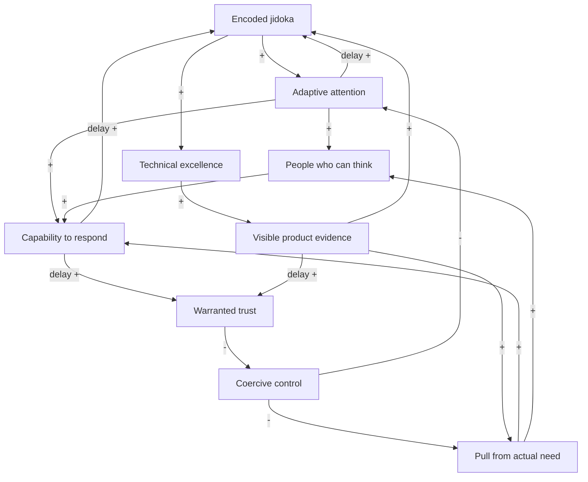
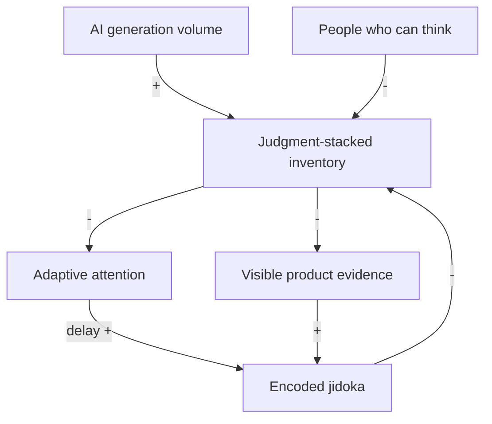

# Draft CLD: TPS reasoning that can inspire LeSS+AI

Companion diagram to [Claim
22](22-cld-shows-tps-reasoning-for-less-ai.md). This file is the
**model**. The claim is the **argument for using a model**.

Draft. Variable names, polarities, and which loops belong on a slide
will move. The diagram is a qualitative map of the existing claims, not
a calibrated simulation.

## How to read

A **variable** is a quantity that can rise or fall. An arrow is a
causal link:

| Mark | Name | Meaning |
|---|---|---|
| **+** | same direction | If the cause rises, the effect rises (and if it falls, the effect falls), other things equal. |
| **−** | opposite direction | If the cause rises, the effect falls (and if it falls, the effect rises), other things equal. |

A loop is **reinforcing (R)** when it has an even number of **−** links:
a change feeds back in the same direction. It can run as a virtuous or
a vicious cycle. A loop is **balancing (B)** when it has an odd number
of **−** links: it pushes back toward a limit or a target.

`//` on a link marks a **delay**. Figures write `delay +` for a delayed
same-direction link. Delays matter here: AI can shorten generation
while encoding, trust, and capability still take time.

## Variables

Each variable is owned by existing claims. Do not invent a second
definition here.

| Variable | What rises or falls | Claim owners |
|---|---|---|
| **Encoded jidoka** | Learned judgment in a closed, stoppable form: detect a specified abnormality, halt, contain, prevent recurrence. Tests that actually stop, types, poka-yoke, an andon. Smart → dumb → gone. | [6](06-jidoka-embeds-routine-judgment.md), [19](19-stop-and-fix.md), [20](20-poka-yoke-supports-jidoka.md), [21](21-ci-practice-is-not-a-ci-system.md) |
| **Adaptive attention** | Room, information, skill, and authority to investigate what is not yet known, rather than watch the routine or re-judge the known. | [3](03-jidoka-enables-jit-trusts-respect-grows.md), [6](06-jidoka-embeds-routine-judgment.md), [10](10-freedom-and-trust-reinforce-through-jidoka.md) |
| **Capability to respond** | Resourceful, close-to-the-work response to actual need: detect, coordinate, change cheaply, recover, leave the system more capable. | [3](03-jidoka-enables-jit-trusts-respect-grows.md), [4](04-jit-assurance-resourcefulness-and-constraint.md) |
| **People who can think** | People grown by the work: problem solving, facilitation, analysis, coaching, independent kaizen. | [12](12-respect-for-people-who-can-think.md) |
| **Warranted trust** | Mutual, evidenced confidence. Not faith, and not Toyota's definition of JIT. | [3](03-jidoka-enables-jit-trusts-respect-grows.md), [10](10-freedom-and-trust-reinforce-through-jidoka.md) |
| **Coercive control** | Approvals, surveillance, detailed plans far in advance, narrow roles, rules imposed from outside the work. | [10](10-freedom-and-trust-reinforce-through-jidoka.md) |
| **Pull from actual need** | Work and collaboration triggered by concrete need: JIT operationally; Whole Product Focus in LeSS. | [3](03-jidoka-enables-jit-trusts-respect-grows.md), [4](04-jit-assurance-resourcefulness-and-constraint.md), [8](08-technical-excellence-enables-jit-coordination-in-less.md), [17](17-jit-vertical-slicing-one-piece-flow.md) |
| **Technical excellence** | Cheap, safe change of one shared product so several feature teams can integrate continuously. The catalog exists *for* that integration. | [8](08-technical-excellence-enables-jit-coordination-in-less.md) |
| **Visible product evidence** | Current integrated working software, plus visible abnormalities and dependencies. Transparency for the people doing the work, not a remote-control dashboard. | [8](08-technical-excellence-enables-jit-coordination-in-less.md), [16](16-go-see-ai-harness.md), [21](21-ci-practice-is-not-a-ci-system.md) |
| **AI generation volume** | Candidate solutions, tests, analysis, and patches produced quickly. Not yet owned, verified, or encoded. | [1](01-tps-reasoning-not-mechanisms.md), [10](10-freedom-and-trust-reinforce-through-jidoka.md) |
| **Judgment-stacked inventory** | Unverified, unowned, still-smart work in process: generated analysis, patches that look finished until a person re-judges them, tests nobody can trust. Software's analogue of stockpiling. | [4](04-jit-assurance-resourcefulness-and-constraint.md), [6](06-jidoka-embeds-routine-judgment.md), [11](11-physical-production-and-software-differences.md) |

## Canonical links

This table is the source of truth. The figures are views of it.

| From | | To | Why, in one line |
|---|---|---|---|
| Encoded jidoka | **+** | Adaptive attention | Known abnormality is constrained; attention is free for novelty. |
| Adaptive attention | **+** | Capability to respond | People can investigate, stop, and improve instead of firefighting the known. |
| Adaptive attention | **+** | People who can think | The work itself is the school; that needs room to think. |
| Adaptive attention | **+** `//` | Encoded jidoka | Investigate the novel (smart), then put what is now known into a closed detector (dumb) or remove the question (gone). |
| People who can think | **+** | Capability to respond | JIT and jidoka only work through people who can think. |
| Capability to respond | **+** `//` | Warranted trust | Visible, responsible use of freedom warrants *entrusting* the next highest-value item. |
| Capability to respond | **+** `//` | Encoded jidoka | Kaizen after a real response preserves the learning. |
| Warranted trust | **−** | Coercive control | Mutual confidence reduces the perceived need for advance control. |
| Coercive control | **−** | Pull from actual need | Detailed plans and approvals push work before the need is concrete. |
| Coercive control | **−** | Adaptive attention | Surveillance, narrow roles, and re-approval consume the room jidoka created. |
| Pull from actual need | **+** | Capability to respond | Real problems, not stockpiles, grow resourceful response. |
| Pull from actual need | **+** | People who can think | Challenge and actual need develop thinking. |
| Technical excellence | **+** | Visible product evidence | Continuous integration of small changes makes the current product and its collisions visible. |
| Encoded jidoka | **+** | Technical excellence | Closed stops, fail-fast, and an andon that actually halts keep the product safely changeable. |
| Visible product evidence | **+** | Pull from actual need | Integration of customer-centric work pulls collaboration when a dependency is concrete. |
| Visible product evidence | **+** | Encoded jidoka | Stop & Fix: a visible abnormality can become a closed detector or a gone design. |
| Visible product evidence | **+** `//` | Warranted trust | Transparency of working software is evidence, not a dashboard for remote control. |
| AI generation volume | **+** | Judgment-stacked inventory | Faster candidates, still needing live judgment, accumulate unless encoded or discarded. |
| Encoded jidoka | **−** | Judgment-stacked inventory | Closed detectors and prevention keep generated work from remaining smart inventory. |
| People who can think | **−** | Judgment-stacked inventory | Ownership, verification, and encoding prevent stacking. |
| Judgment-stacked inventory | **−** | Adaptive attention | Re-judging the known consumes the attention jidoka was meant to free. |
| Judgment-stacked inventory | **−** | Visible product evidence | Unintegrated, unowned output hides the real product and delays abnormality. |

## Figure 1 — The operating engine

TPS pillars and the LeSS translation, without AI. Read top to bottom as
[Claim 10](10-freedom-and-trust-reinforce-through-jidoka.md)'s sequence,
then follow the return arrows that close the loops.

## Figure 2 — AI as amplifier

Same engine, with the injection that changes the gain. AI does not add
a third pillar. It strengthens whichever direction the inventory loop
is already running.

## Loop catalog

### R1 — Encode the known, free attention

**Encoded jidoka → Adaptive attention → Encoded jidoka**

Jidoka constrains what is already known to be abnormal so people have
more freedom and attention for what is not yet known. That attention
investigates novelty and, after a delay, puts reliable learning into a
simpler detector or removes the question. [Claim
6](06-jidoka-embeds-routine-judgment.md)'s descent **smart → dumb →
gone** is this loop, not a one-time cleanup.

Runs backward when detectors stay smart: every check still needs a
thinker, so encoded jidoka never rises and attention never returns.

### R2 — Freedom and entrustment

**Adaptive attention → Capability to respond → Warranted trust → (−)
Coercive control → Pull from actual need → Capability to respond**

[Claim 10](10-freedom-and-trust-reinforce-through-jidoka.md)'s proposed
loop, drawn as a cycle. The polarity is **freedom and entrustment**
(jidoka frees, JIT entrusts). Mutual **warranted trust** sits under
Respect for People; in this diagram it is the evidence that makes
entrustment social. Jidoka and technical excellence create room so a
team can take the next highest-value item. Demonstrated capability
warrants that *entrustment*. Coercive control falls. The Product Owner
can pull from actual user value instead of leftover WIP. That action is
further evidence of capability.

Two **−** links (warranted trust reduces coercive control; coercive
control reduces pull) keep the loop reinforcing: more warranted trust →
more pull → more capability → more warranted trust.

The same loop is vicious when every failure produces more approvals, or
when freedom is used to hide work. Then coercive control rises,
attention falls, capability falls, and the next failure “justifies”
still more control. Adding approvals *intends* to contain failure; that
intent is not the loop polarity. Enabling constraints (encoded jidoka)
are the other response to failure; they belong in R1, not here.

### R3 — Technical excellence for continuous integration

**Technical excellence → Visible product evidence → Encoded jidoka →
Technical excellence**

and, branching from the same evidence:

**Visible product evidence → Pull from actual need**

[Claim 8](08-technical-excellence-enables-jit-coordination-in-less.md)'s
chain. Excellence exists so several feature teams can integrate one
product continuously. Integration exposes abnormalities and
dependencies. Those can become encoded stops and can pull self-managed
collaboration. Customer-centric teams and one ordered backlog aim that
capability at user value.

A green pipeline that does not halt, or a CI system without the
developer practice, is a break in this loop: [Claims
19](19-stop-and-fix.md) and
[21](21-ci-practice-is-not-a-ci-system.md).

### R4 — The work makes people

**Pull from actual need → People who can think → Capability to respond
→ Pull from actual need** (via R2)

[Claim 12](12-respect-for-people-who-can-think.md): the operating
system requires people who can think, and the work is the school that
makes them. Pull supplies real problems. Adaptive attention (R1) is
the condition under which those problems grow people rather than grind
them. [Claim 3](03-jidoka-enables-jit-trusts-respect-grows.md) already
records the failure: without challenge, support, and stoppable
abnormalities, the same tightness is pressure rather than growth.

### B1 — Stop and contain

**Visible product evidence → Encoded jidoka → (−) recurring
abnormalities → (−) Visible product evidence** (of those defects)

Odd number of **−** links once “recurring abnormalities” is named: stop
& fix pushes a known defect down. The *learning* from that stop still
feeds R1 and R3. Containment is balancing; capability growth is
reinforcing. Mixing the two on one arrow is how a talk can sound as if
“more tests automatically mean more trust.”

### R5 — Inventory, attention, and AI

**Judgment-stacked inventory → (−) Adaptive attention → (+) Encoded
jidoka → (−) Judgment-stacked inventory**

Two **−** links: reinforcing. Direction depends on starting condition.

- **Virtuous:** low stacked inventory → attention available → encoding
  rises → inventory stays low. AI can help *if* people use it to
  understand and encode, not to dump output. [Claim
  10](10-freedom-and-trust-reinforce-through-jidoka.md)'s
  comprehension-versus-delegation evidence sits here.
- **Vicious:** high stacked inventory → attention consumed by
  re-judgment → encoding falls → inventory rises. AI generation volume
  injects **+** into inventory, raising the gain. DORA's 2025 finding
  that AI amplifies the underlying system is this loop, not a separate
  AI pillar.

[Claim 4](04-jit-assurance-resourcefulness-and-constraint.md): do not
compensate for uncertainty by accumulating everything in advance.
[Claim 11](11-physical-production-and-software-differences.md): do not
stockpile unverified work. R5 is those warnings as a cycle.

## Delays that matter for the talk

| Link | Why the delay is the point |
|---|---|
| Adaptive attention → Encoded jidoka | Investigation is slow relative to generation. If AI shortens only generation, inventory grows during the encoding delay. |
| Capability → Warranted trust | Trust is earned by repeated visible response, not by declaring people resourceful. |
| Visible product evidence → Warranted trust | One green build is not mutual trust. A history of stoppable, improvable product is. |
| Capability → Encoded jidoka | Kaizen after response is not automatic. Without it, R2 looks like heroics and does not accumulate. |

The talk contrast is not “AI is fast, humans are slow.” It is: **the
generation link can outrun the encoding and trust links.** TPS
reasoning is how to keep those links coupled.

## Left off the diagram on purpose

Mechanisms that already live inside a variable, until a slide needs
them named:

- **SMED / cheap changeover** — inside technical excellence and [Claim
  5](05-smed-software-changeover-and-ai-friendly-context.md); the
  trajectory toward perfection is [Claim
  18](18-continuous-improvement-towards-perfection.md).
- **Poka-yoke, tests, fail-fast, CI system as andon** — inside encoded
  jidoka.
- **Nemawashi** — a social path that can grow warranted trust and pull
  aligned action; [Claim
  9](09-nemawashi-self-organized-deliberation-in-less.md) owns it. Not
  yet a separate loop.
- **Go See** — how visible product evidence stays firsthand, including
  the AI harness; [Claim 16](16-go-see-ai-harness.md).
- **Utilization pressure** filling unused capacity after need is met —
  [Claim 4](04-jit-assurance-resourcefulness-and-constraint.md). A
  candidate extra **+** from “keep busy” into judgment-stacked
  inventory. Add when a story needs it.
- **The Algorithm** — family resemblance, not a loop in this map;
  [Claim 7](07-the-algorithm-and-tps-family-resemblance.md).
