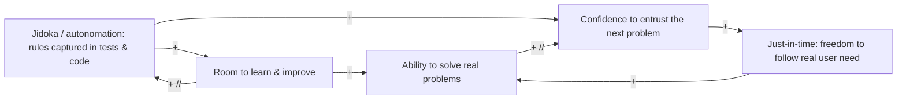
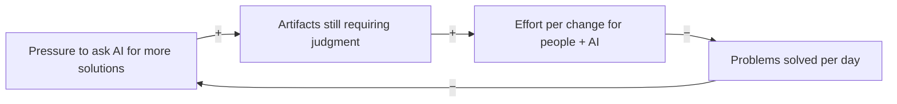

# CLD: TPS reasoning that can inspire LeSS+AI

Companion diagram to [Claim
22](22-cld-shows-tps-reasoning-for-less-ai.md). This file is the
**model**. The claim is the **argument for using a model**.

The slide figure set is settled: the two named figures below.
Polarities remain interpretive readings of the claims, and the map
stays qualitative, not a calibrated simulation.

## How to read

A **variable** is a quantity that can rise or fall. An arrow is a
causal link:

| Mark | Name | Meaning |
|---|---|---|
| **+** | same direction | If the cause rises, the effect rises (and if it falls, the effect falls), other things equal. |
| **−** | opposite direction | If the cause rises, the effect falls (and if it falls, the effect rises), other things equal. |

A loop is **reinforcing (R)** when it has an even number of **−** links:
a change feeds back in the same direction. It can run as a virtuous or
a vicious cycle. A loop is **balancing (B)** when it has an odd number
of **−** links: it pushes back toward a limit or a target.

`//` on a link marks a **delay**. Figure 1 writes `+ //` for a delayed
same-direction link. Delays matter here: AI can shorten generation
while encoding, trust, and capability still take time.

## Variables

Each variable is owned by existing claims. Do not invent a second
definition here.

| Variable | What rises or falls | Claim owners |
|---|---|---|
| **Encoded jidoka** | Learned judgment in a closed, stoppable form: detect a specified abnormality, halt, contain, prevent recurrence. Tests that actually stop, types, poka-yoke, an andon. Earlier judgment-intensive creation produces a judgment-preserving mechanism; removing an unnecessary part or failure-producing path can remove its recurring question. | [6](06-jidoka-embeds-routine-judgment.md), [19](19-stop-and-fix.md), [20](20-poka-yoke-supports-jidoka.md), [21](21-ci-practice-is-not-a-ci-system.md), [24](24-warnings-as-stop-no-news-is-good-news.md) |
| **Adaptive attention** | Room, information, skill, and authority to investigate what is not yet known, rather than watch the routine or re-judge the known. | [3](03-jidoka-enables-jit-trusts-respect-grows.md), [6](06-jidoka-embeds-routine-judgment.md), [10](10-freedom-and-trust-reinforce-through-jidoka.md) |
| **Capability to respond** | Resourceful, close-to-the-work response to actual need: detect, coordinate, change cheaply, recover, leave the system more capable. | [3](03-jidoka-enables-jit-trusts-respect-grows.md), [4](04-jit-assurance-resourcefulness-not-abundance.md) |
| **People who can think** | People grown by the work: problem-solving and teaching others to solve problems (the sourced skills; any longer list is Claim 12's open choice). | [12](12-respect-for-people-who-can-think.md) |
| **Warranted trust** | Mutual, evidenced confidence. Not faith, and not Toyota's definition of JIT. | [3](03-jidoka-enables-jit-trusts-respect-grows.md), [10](10-freedom-and-trust-reinforce-through-jidoka.md) |
| **Coercive control** | Approvals, surveillance, detailed plans far in advance, narrow roles, rules imposed from outside the work. | [10](10-freedom-and-trust-reinforce-through-jidoka.md) |
| **Pull from actual need** | Work and collaboration triggered by concrete need: JIT operationally; Whole Product Focus in LeSS. | [3](03-jidoka-enables-jit-trusts-respect-grows.md), [4](04-jit-assurance-resourcefulness-not-abundance.md), [8](08-technical-excellence-enables-jit-coordination-in-less.md), [17](17-jit-vertical-slicing-one-piece-flow.md) |
| **Technical excellence** | Cheap, safe change of one shared product so several feature teams can integrate continuously. The catalog exists *for* that integration. | [8](08-technical-excellence-enables-jit-coordination-in-less.md) |
| **Visible product evidence** | Current integrated working software, plus visible abnormalities and dependencies. Transparency for the people doing the work, not a remote-control dashboard. | [8](08-technical-excellence-enables-jit-coordination-in-less.md), [16](16-go-see-ai-harness.md), [21](21-ci-practice-is-not-a-ci-system.md) |
| **AI generation volume** | Rate of producing new solutions whose understanding, verification, use, or future change still needs judgment. Includes code, tests, analyses, and designs; generating a solution does not resolve the judgment left in its use. | [00](00-judgment-intensive-work.md), [1](01-tps-reasoning-not-mechanisms.md), [10](10-freedom-and-trust-reinforce-through-jidoka.md) |
| **Judgment-stacked inventory** | Unverified, unowned, judgment-loaded output: generated analysis, patches that look finished until a person must interpret, rank, and re-decide, tests nobody can trust, leftover warnings. Software's analogue of stockpiling. | [00](00-judgment-intensive-work.md), [4](04-jit-assurance-resourcefulness-not-abundance.md), [6](06-jidoka-embeds-routine-judgment.md), [11](11-physical-production-and-software-differences.md), [24](24-warnings-as-stop-no-news-is-good-news.md) |
| **Interpretation and rework effort** | Effort per change to reconstruct intent, reconcile assumptions, verify, and repair. Both people and AI spend it. Slide label: **Effort per change for people + AI**. | [00](00-judgment-intensive-work.md), [5](05-smed-software-changeover-and-ai-friendly-context.md) |
| **Completion rate** | Rate of solving product problems through understood, verified, integrated changes with ownership. Slide label: **Problems solved per day**. Includes people and AI working together. Drafting alone does not count. | [00](00-judgment-intensive-work.md), [5](05-smed-software-changeover-and-ai-friendly-context.md), [8](08-technical-excellence-enables-jit-coordination-in-less.md) |
| **Pressure for more AI solutions** | Pressure to respond to poor progress by asking AI to generate more solutions. Slide label: **Pressure to ask AI for more solutions**. Pressure is distinct from actual generation throughput. | Terry's slide 8 sketch and accepted talk choice; qualitative response assumption |
| **Judgment-loaded artifacts** | Accumulated artifacts whose use or change still requires live judgment, including working code and useful documents. Slide label: **Artifacts still requiring judgment**. This can grow even when individual problems have been solved; it is broader than unfinished inventory. | [00](00-judgment-intensive-work.md), [6](06-jidoka-embeds-routine-judgment.md) |

## Canonical links

This table is the source of truth. The figures are views of it.

| From | | To | Why, in one line |
|---|---|---|---|
| Encoded jidoka | **+** | Adaptive attention | Known abnormality is encoded as a closed stop; attention is free for novelty. |
| Encoded jidoka | **+** | Warranted trust | Reliable, owned rules that prevent or stop known mistakes give confidence to entrust the next problem directly, alongside demonstrated capability. |
| Adaptive attention | **+** | Capability to respond | People can investigate, stop, and improve instead of firefighting the known. |
| Adaptive attention | **+** | People who can think | The work itself is the school; that needs room to think. |
| Adaptive attention | **+** `//` | Encoded jidoka | Judgment-intensive investigation can produce a judgment-preserving closed detector or a judgment-removing design. |
| People who can think | **+** | Capability to respond | JIT and jidoka only work through people who can think. |
| Capability to respond | **+** `//` | Warranted trust | Visible, responsible use of freedom warrants *entrusting* the next highest-value item. |
| Capability to respond | **+** `//` | Encoded jidoka | Kaizen after a real response preserves the learning. |
| Warranted trust | **−** | Coercive control | Mutual confidence reduces the perceived need for advance control. |
| Coercive control | **−** | Pull from actual need | Detailed plans and approvals push work before the need is concrete. |
| Coercive control | **−** | Adaptive attention | Surveillance, narrow roles, and re-approval consume the room jidoka created. |
| Pull from actual need | **+** | Capability to respond | Real problems, not stockpiles, grow resourceful response. |
| Pull from actual need | **+** | People who can think | Challenge and actual need develop thinking. |
| Technical excellence | **+** | Visible product evidence | Continuous integration of small changes makes the current product and its collisions visible. |
| Encoded jidoka | **+** | Technical excellence | Closed stops, fail-fast, and an andon that actually halts keep the product safely changeable. |
| Visible product evidence | **+** | Pull from actual need | Integration of customer-centric work pulls collaboration when a dependency is concrete. |
| Visible product evidence | **+** | Encoded jidoka | Stop & Fix: a visible abnormality can become a judgment-preserving closed detector or a judgment-removing design. |
| Visible product evidence | **+** `//` | Warranted trust | Transparency of working software is evidence, not a dashboard for remote control. |
| AI generation volume | **+** | Judgment-stacked inventory | Faster judgment-loaded candidates accumulate unless understood, verified, encoded, or discarded. |
| Encoded jidoka | **−** | Judgment-stacked inventory | Closed detectors and prevention keep judgment-loaded output from accumulating as inventory. |
| People who can think | **−** | Judgment-stacked inventory | Ownership, verification, and encoding prevent stacking. |
| Judgment-stacked inventory | **−** | Adaptive attention | Re-judging the known consumes the attention jidoka was meant to free. |
| Judgment-stacked inventory | **−** | Visible product evidence | Unintegrated, unowned output hides the real product and delays abnormality. |
| Judgment-stacked inventory | **+** | Interpretation and rework effort | Unresolved decisions and interacting drafts require people and AI to reconstruct more context, reconcile assumptions, and repair. |
| Interpretation and rework effort | **−** | Completion rate | With finite capacity, each change taking more effort leaves fewer changes finished per unit time. |
| Completion rate | **−** | Judgment-stacked inventory | Finishing and integrating an unresolved item removes it from the unfinished pile; arrivals are held equal. |
| Interpretation and rework effort | **−** | AI generation volume | With finite agent capacity, context recovery and retries on earlier output leave less capacity for new drafts. |
| Completion rate | **−** | Pressure for more AI solutions | When poor progress is answered with more generation, fewer problems solved raises pressure to ask AI again. |
| Pressure for more AI solutions | **+** | AI generation volume | More pressure prompts more requests for new solutions, within available capacity. |
| AI generation volume | **+** | Judgment-loaded artifacts | Solutions that leave live judgment in their use or change add to the accumulated demand, even if they solve an immediate problem. |
| Judgment-loaded artifacts | **+** | Interpretation and rework effort | Subsequent changes require people and AI to reconstruct intent, interpret rules, reconcile assumptions, and verify more context. |

The effort, completion, and pressure links are the early-stage model for the
talk. They apply to work on one evolving product with finite capacity;
they are qualitative hypotheses, not measured universal laws. Isolated
experiments that are discarded need not contribute to inventory. More
completions must actually resolve the work's outstanding judgment and
ownership; merely calling a draft done does not drain the pile. A completed
solution may still leave a judgment-loaded artifact for future use. The
pressure response is a conditional behavioral assumption, not an automatic
consequence of slowing down.

## Figures

These two figures are the slide set: views of the canonical link
table trimmed to presentation scale, at most six variables each. The
full map lives in the table, not in any figure, and the loop arguments
live in the Loop catalog, not in the captions.

### Figure 1 — Freedom and entrustment — the engine

[Claim 10](10-freedom-and-trust-reinforce-through-jidoka.md)'s theme
drawn as two coupled reinforcing loops: jidoka frees (R1), JIT
entrusts (R2). Five plain-language labels replace the six-variable slide
view. **Rules captured in tests & code** names encoded jidoka;
**Room to learn & improve** names adaptive attention; **Ability to solve
real problems** names capability to respond; **Confidence to entrust the
next problem** names warranted trust; and **Freedom to follow real user
need** names the room to let actual need pull work. The last two share one
positive arrow condensing warranted trust → (−) coercive control → (−)
pull from actual need. The two negative links make the condensed path
positive; the control variable remains in the canonical table and R2.

The figure omits other canonical links that are not needed for this story,
including coercive control → (−) adaptive attention and the delayed
capability to respond → encoded jidoka. Delays remain visible on learning
being encoded and capability earning confidence. Confidence must be grounded
in visible, responsible results; the arrow does not assert that skill alone
automatically produces trust.

The direct encoded-jidoka → warranted-trust link shows a second basis for
confidence: trustworthy safeguards already protect against known failures.
It complements the capability path. More rules or generated tests alone do
not justify confidence; the rules must be understood, owned, exercised, and
effective as prevention or stops. Slide endpoints also name **Jidoka /
autonomation** and **Just-in-time** explicitly, with a level balance below
to answer the earlier slide's apparent tradeoff.

```mermaid
flowchart LR
  EJ[Jidoka / autonomation: rules captured in tests & code]
  AA[Room to learn & improve]
  CAP[Ability to solve real problems]
  WT[Confidence to entrust the next problem]
  PULL[Just-in-time: freedom to follow real user need]

  EJ -->|"+"| AA
  AA -->|"+ //"| EJ
  AA -->|"+"| CAP
  EJ -->|"+"| WT
  CAP -->|"+ //"| WT
  WT -->|"+"| PULL
  PULL -->|"+"| CAP
```

### Figure 2 — AI speeds whichever loop you feed

The early problem-setting slide: R7, the pressure trap. AI can solve today's
problem while leaving an artifact that makes the next change harder. Effort
rises for people and AI, completion falls, and poor progress creates pressure
to ask AI for more solutions. The pressure-to-artifacts arrow condenses two
canonical links through AI generation volume. R6's unfinished backlog and
B2's agent slowdown remain in the catalog; the slide shows one reinforcing
loop clearly. Learning and encoding remain in R1 and R5 for the later TPS
explanation.

```mermaid
flowchart LR
  AI[Pressure to ask AI for more solutions]
  INV[Artifacts still requiring judgment]
  EFF[Effort per change for people + AI]
  DONE[Problems solved per day]

  AI -->|"+"| INV
  INV -->|"+"| EFF
  EFF -->|"−"| DONE
  DONE -->|"−"| AI
```

## Loop catalog

### R1 — Encode the known, free attention

**Encoded jidoka → Adaptive attention → Encoded jidoka**

Jidoka stops what is already known to be abnormal so people have
more freedom and attention for what is not yet known. That attention
investigates novelty and, after a delay, puts reliable learning into a
simpler detector or removes the question. [Claim
6](06-jidoka-embeds-routine-judgment.md)'s descent **smart → dumb →
gone** is this loop, not a one-time cleanup.

Runs backward when detectors stay judgment-loaded: every check still needs a
thinker, so encoded jidoka never rises and attention never returns.

### R2 — Freedom and entrustment

**Adaptive attention → Capability to respond → Warranted trust → (−)
Coercive control → Pull from actual need → Capability to respond**

[Claim 10](10-freedom-and-trust-reinforce-through-jidoka.md)'s proposed
loop, drawn as a cycle. The theme is **freedom and entrustment**
(jidoka frees, JIT entrusts). Mutual
**warranted trust** sits under
Respect for People; in this diagram it is the evidence that makes
entrustment social. Jidoka and technical excellence create room so a
team can take the next highest-value item. Demonstrated capability
warrants that *entrustment*. Coercive control falls. The Product Owner
can pull from actual user value instead of leftover WIP. That action is
further evidence of capability.

Two **−** links (warranted trust reduces coercive control; coercive
control reduces pull) keep the loop reinforcing: more warranted trust →
more pull → more capability → more warranted trust.

The same loop is vicious when every failure produces more approvals, or
when freedom is used to hide work. Then coercive control rises,
attention falls, capability falls, and the next failure “justifies”
still more control. Adding approvals *intends* to contain failure; that
intent is not the loop polarity. Closed stops (encoded jidoka)
are the other response to failure; they belong in R1, not here.

### R3 — Technical excellence for continuous integration

**Technical excellence → Visible product evidence → Encoded jidoka →
Technical excellence**

and, branching from the same evidence:

**Visible product evidence → Pull from actual need**

[Claim 8](08-technical-excellence-enables-jit-coordination-in-less.md)'s
chain. Excellence exists so several feature teams can integrate one
product continuously. Integration exposes abnormalities and
dependencies. Those can become encoded stops and can pull self-managed
collaboration. Customer-centric teams and one ordered backlog aim that
capability at user value.

A green CI service that does not halt, or a service without the
developer practice, is a break in this loop: [Claims
19](19-stop-and-fix.md) and
[21](21-ci-practice-is-not-a-ci-system.md).

### R4 — The work makes people

**Pull from actual need → People who can think → Capability to respond
→ Pull from actual need** (via R2)

[Claim 12](12-respect-for-people-who-can-think.md): the operating
system requires people who can think, and the work is the school that
makes them. Pull supplies real problems and judgment-intensive product
work. Adaptive attention (R1) is the condition under which those
problems grow people rather than grind them. [Claim
3](03-jidoka-enables-jit-trusts-respect-grows.md) already records the
failure: without challenge, support, and stoppable abnormalities, the
same tightness is pressure rather than growth.

### B1 — Stop and contain

**Visible product evidence → Encoded jidoka → (−) recurring
abnormalities → (−) Visible product evidence** (of those defects)

Odd number of **−** links once “recurring abnormalities” is named: a
justified human-triggered stop contains current propagation before more
output inherits the abnormality and makes the response emergent
judgment-intensive work. Fixing and encoding push recurrence of the
known defect down; stopping does not imply that no output follows. The
*learning* from that stop still feeds R1 and R3. Containment is
balancing; capability growth is reinforcing. Mixing the two on one
arrow is how a talk can sound as if “more tests automatically mean more
trust.”

### R5 — Inventory, attention, and AI

**Judgment-stacked inventory → (−) Adaptive attention → (+) Encoded
jidoka → (−) Judgment-stacked inventory**

Two **−** links: reinforcing. Direction depends on starting condition.

- **Virtuous:** low stacked inventory → attention available → encoding
  rises → inventory stays low. AI can help *if* people use it to
  understand and encode, not to dump output. [Claim
  10](10-freedom-and-trust-reinforce-through-jidoka.md)'s
  comprehension-versus-delegation evidence sits here.
- **Vicious:** high stacked inventory → attention consumed by
  re-judgment → encoding falls → inventory rises. AI generation volume
  injects **+** into inventory, raising the gain. DORA's 2025 finding
  that AI amplifies the underlying system is this loop.

[Claim 4](04-jit-assurance-resourcefulness-not-abundance.md): do not
compensate for uncertainty by accumulating everything in advance.
[Claim 11](11-physical-production-and-software-differences.md): do not
stockpile unverified work. R5 is those warnings as a cycle.

### R6 — The backlog trap

**Judgment-stacked inventory → (+) Interpretation and rework effort →
(−) Completion rate → (−) Judgment-stacked inventory**

Two negative links make this reinforcing. More unresolved work makes the
next change harder to understand and finish. Fewer completions leave more
work unresolved, raising effort again. It can also unwind: resolving or
discarding work reduces the context burden, making further completion
easier. AI drafts inject new arrivals into this loop. [Claim
00](00-judgment-intensive-work.md) makes the demand actor-neutral;
[Claim 5](05-smed-software-changeover-and-ai-friendly-context.md) supplies
the shared cognitive and technical costs for people using AI.

### B2 — AI slows too

**AI generation volume → (+) Judgment-stacked inventory → (+)
Interpretation and rework effort → (−) AI generation volume**

One negative link makes this balancing. Agents spend more capacity
recovering context, reconciling assumptions, and retrying, so new drafting
slows. This limits arrivals through degraded performance; it does not
finish or discard the accumulated work. It can coexist with R6's growing
backlog whenever arrivals still exceed completion. A falling output rate
alone is not recovery, and the model does not assert indefinite growth
under every condition.

### R7 — Pressure to ask AI for more solutions

**Pressure for more AI solutions → (+) AI generation volume → (+)
Judgment-loaded artifacts → (+) Interpretation and rework effort → (−)
Completion rate → (−) Pressure for more AI solutions**

Two negative links make this reinforcing. The four-node slide condenses
pressure → generation → artifacts into one positive arrow. The immediate
win can be real: AI solved a problem. If the artifact still needs judgment
to use or change, however, it adds effort to later work. Fewer problems
solved per day can then prompt the response "ask AI for more solutions,"
feeding the same demand. This response is the talk's stated assumption,
not a universal rule or a claim that slowing agents magically produce more.
Pressure and actual output must remain distinct; B2 may limit output even
as pressure rises. The previous slide's executable rule points toward the
alternative: preserve learning so future use needs less repeated judgment.

## Delays that matter for the talk

| Link | Why the delay is the point |
|---|---|
| Adaptive attention → Encoded jidoka | Investigation is slow relative to generation. If AI shortens only generation, inventory grows during the encoding delay. |
| Capability → Warranted trust | Trust is earned by repeated visible response, not by declaring people resourceful. |
| Visible product evidence → Warranted trust | One green build is not mutual trust. A history of stoppable, improvable product is. |
| Capability → Encoded jidoka | Kaizen after response is not automatic. Without it, R2 looks like heroics and does not accumulate. |

The talk contrast is not “AI is fast, humans are slow.” It is: **the
generation link can outrun the encoding and trust links.** TPS
reasoning is how to keep those links coupled.

## Left off the diagram on purpose

Mechanisms that already live inside a variable, until a slide needs
them named:

- **SMED / cheap changeover** — inside technical excellence and [Claim
  5](05-smed-software-changeover-and-ai-friendly-context.md); the
  trajectory toward perfection is [Claim
  18](18-continuous-improvement-towards-perfection.md).
- **Poka-yoke, tests, fail-fast, CI service** — inside encoded
  jidoka.
- **Nemawashi** — a social path that can grow warranted trust and pull
  aligned action; [Claim
  9](09-nemawashi-self-organized-deliberation-in-less.md) owns it. Not
  yet a separate loop.
- **Go See** — how visible product evidence stays firsthand, including
  the AI harness; [Claim 16](16-go-see-ai-harness.md).
- **Utilization pressure** filling unused capacity after need is met —
  [Claim 4](04-jit-assurance-resourcefulness-not-abundance.md). A
  candidate extra **+** from “keep busy” into judgment-stacked
  inventory. Add when a story needs it.
- **The Algorithm** — family resemblance, not a loop in this map;
  [Claim 7](07-the-algorithm-and-tps-family-resemblance.md).
