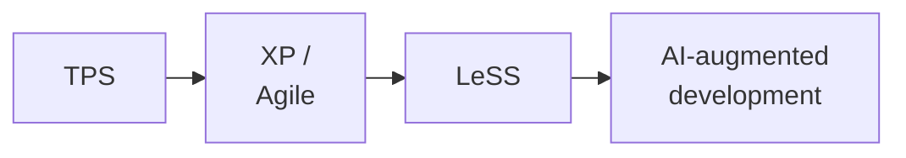
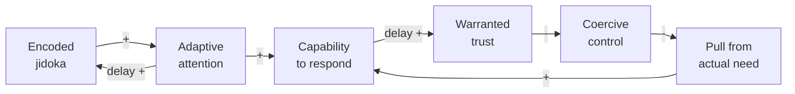
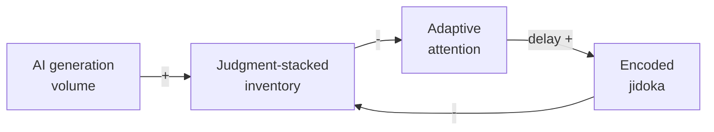

<div class="relative z-10 w-[47%] text-left">

# Freedom and Entrustment

What AI-Augmented Development and LeSS Can Learn from the TPS

Terry Yin · Odd-e

Tokyo LeSS Conference · 2026

</div>

<!--
The subtitle carries the boundary: this is not a factory recipe applied to
software (Claim 11). We borrow the reasoning with which Toyota made a whole
system responsive and learnable (Claim 1).
-->

---

# About Me

I coach **LeSS** and technical practices at **Odd-e**.

Nearly **30 years** building software, including a decade inside Nokia R&D —
and I still program.

<div class="mt-6 text-xl opacity-70">
Still programming. Still learning. Now asking what AI should free us from.
</div>

<div class="mt-4 text-lg opacity-60">
Terry Yin · Singapore · terry@odd-e.com
</div>

<!--
Lizard makes complexity visible in code; TPS makes abnormalities visible in
a system. This is why I came to TPS through software problems, not as a
manufacturing tourist.

[Sources]
- https://less.works/profiles/terry-yin
- https://github.com/terryyin/lizard
[/Sources]
-->

---
layout: image-right
image: /preaching-to-the-buddha.png
backgroundSize: contain
---

# 釈迦に説法

*Preaching to the Buddha* — sharing about TPS, in Tokyo, at a LeSS
conference.

But TPS has inspired and benefited me so much — before the AI era, and
even more in it — that I cannot resist shamelessly sharing.

- Software is **not a factory** — it mixes discovery and production in
  one evolving product
- So this talk takes TPS as **inspiration and reasoning**, never a recipe
  to apply directly

<!--
Carries the talk boundary up front so it need not repeat later:
Claims 1 (reasoning, not mechanisms) and 11 (software differences).
-->

---
layout: center
class: text-center
---

# One lineage of inspiration



**TPS** inspired **XP** and the Agile movement,

then **LeSS** —

and now, **AI-augmented development**.

---
layout: center
class: text-center
---

## How do you know if the organization is using AI right?

# If the teams are more **freed** than **constrained** by what they built.

<!--
The diagnostic question — one of the first slides (stage setting).
Claim 10.
-->

---
layout: image-right
image: /constrained-by-what-they-built.png
backgroundSize: contain
---

# Constrained by what they built

- Leftover ownership
- Unfinished, judgment-dependent work
- Unable to take the next highest-value item

Being **constrained** ≠ taking **responsibility**

---
layout: statement
---

# AI can produce plausible software faster than a product group can absorb it

A generated branch, test, analysis, or design is not yet capability.
Until it is understood, owned, integrated, and judged, it is **inventory**
someone must supervise or re-judge — teams **constrained** by what they
built.

Or AI helps make the next slice smaller and known failures easier to
prevent or stop — teams **freed** by what they built.

## **AI speeds whichever loop you feed.**

<!--
Sets the AI stage early: this talk is also about AI-augmented development.
Connects back to the diagnostic (freed vs constrained) and forward to the
loops. Loop map: Claim 22; generation cheap / judgment expensive belongs
to the jidoka cluster (Claim 6).

Doughnut — the notebook product we use in LeSS in Action. A
Cursor-coauthored `/sync` pull lands remote note changes in one commit:
12 files, 558 insertions, on CLI files six authors are sharing that week
(2026-07-27). User-facing, and it ships — but it never becomes a small
stoppable change. Same-day follow-up on that surface is the absorb cost:
Cursor pins `/export` tree and body; Claude then fixes a `/sync`
usage-error spinner. After this episode the group is more constrained by
what they built: generated volume outpaces absorption.
Hashes: `7b61a5705c` (`/sync` pull), `fce957dd3d` (`/export` pin),
`c657c674ad` (`/sync` spinner).
-->

---
layout: section
---

# The apparent tradeoff

<!--
Main message setup: freedom and entrustment mistakenly treated as a tradeoff.
-->

---

# Freedom vs. entrustment?

To hand over the work that matters, it seems you must **constrain** people
in advance.

To give real freedom, it seems you **cannot hand over** the work that
matters.

**Entrust**, 任せる · **trust**, 信頼


<!--
Language contrast for the mixed international / Japanese audience.
TPS shows they reinforce each other instead — next slide. Claim 10.
-->

---
layout: quote
---

> **TPS shows how a system can continually convert learning into constraints
> that make greater freedom responsible — and use that freedom to produce
> the next learning on which deeper entrustment, and then mutual trust,
> can rest.**

<!--
The main message. Claim 10.
-->

---
layout: two-cols-header
---

# Two houses, different layers

::left::

**Toyota's official TPS overview**

Pillars: **Jidoka** · **Just-in-Time**

Toyota's explanation of its operating system
(not labelled a house)

<div class="mt-6 text-[11px] leading-tight opacity-70">
  Source: <a href="https://global.toyota/en/company/vision-and-philosophy/production-system/index.html">Toyota Motor Corporation, “Toyota Production System”</a>
</div>

::right::

**Larman & Vodde's Lean Thinking house**


<div class="mt-1 text-center text-[9px] leading-tight opacity-70">
  Larman & Vodde, <em>Scaling Lean and Agile Development</em>, Fig. 3.1 (2009)<br>
  <a href="https://less.works/resources/graphics/book-images">Creative Commons for presentations via less.works</a>
</div>

<!--
Show Toyota's official overview first, then the Larman/Vodde synthesis —
related but different layers, not a taxonomy. Do not present an unsourced
house-shaped TPS diagram as Toyota's. Claim 2.
-->

---

# The triad

<svg class="mx-auto mt-1 h-[330px] w-[88%]" viewBox="0 0 900 360" role="img" aria-labelledby="triad-title triad-description">
  <title id="triad-title">Jidoka, Just-in-Time, and Respect for People</title>
  <desc id="triad-description">
    A triangle showing that Jidoka frees attention, Just-in-Time entrusts
    response to real need, and Respect for People grows capability.
  </desc>
  <path
    d="M 450 62 L 155 290 L 745 290 Z"
    fill="none"
    stroke="#78716c"
    stroke-width="3"
    stroke-linejoin="round"
  />
  <g font-family="inherit" text-anchor="middle">
    <g transform="translate(300 165) rotate(-38)">
      <rect x="-82" y="-24" width="164" height="48" rx="24" fill="#ece6dc" />
      <text y="7" fill="#b33a2b" font-weight="700" style="font-size: 28px">frees</text>
    </g>
    <text x="305" y="207" fill="#57534e" style="font-size: 16px">attention for real need</text>
    <g transform="translate(600 165) rotate(38)">
      <rect x="-82" y="-24" width="164" height="48" rx="24" fill="#ece6dc" />
      <text y="7" fill="#b33a2b" font-weight="700" style="font-size: 28px">grows</text>
    </g>
    <text x="595" y="207" fill="#57534e" style="font-size: 16px">capability to respond</text>
    <g transform="translate(450 290)">
      <rect x="-95" y="-25" width="190" height="50" rx="25" fill="#ece6dc" />
      <text y="8" fill="#b33a2b" font-weight="700" style="font-size: 28px">entrusts</text>
    </g>
    <text x="450" y="328" fill="#57534e" style="font-size: 16px">response instead of stockpiles</text>
    <g transform="translate(450 58)">
      <rect x="-112" y="-34" width="224" height="68" rx="16" fill="#292524" />
      <text y="10" fill="#fffaf3" font-weight="700" style="font-size: 31px">Jidoka</text>
    </g>
    <g transform="translate(155 290)">
      <rect x="-112" y="-34" width="224" height="68" rx="16" fill="#292524" />
      <text y="10" fill="#fffaf3" font-weight="700" style="font-size: 31px">JIT</text>
    </g>
    <g transform="translate(745 290)">
      <rect x="-135" y="-42" width="270" height="84" rx="16" fill="#292524" />
      <text y="-4" fill="#fffaf3" font-weight="700" style="font-size: 25px">Respect for</text>
      <text y="27" fill="#fffaf3" font-weight="700" style="font-size: 25px">People</text>
    </g>
  </g>
</svg>

Technical excellence keeps the shared product and its abnormalities visible
soon enough for teams to collaborate just in time.

<!--
Claims 3, 12, 8.
-->

---

# The engine of freedom and entrustment



Two reinforcing loops: **jidoka frees** attention; **JIT entrusts** capability.

<!--
The triad drawn as loops — Figure 1 of Claim 22's companion CLD
(R1 encode-and-free, R2 freedom-and-entrustment). Walk it until it
closes: encoded learning frees attention; attention builds capability;
capability earns warranted trust (delayed); trust lowers coercive
control; low control lets actual need pull; pull grows capability.
Claims 22 and 10.
-->

---

# AI speeds whichever loop you feed



AI **raises the gain** on the loop you are already running.

<!--
Figure 2 of Claim 22's companion CLD (R5), overlaying the engine's R1.
Reinforcing, so it runs virtuous or vicious depending on the starting
condition — the DORA 2025 amplifier finding as structure. Reprises the
early statement slide's punchline now that the engine has been walked.
Claim 22.
-->

---
layout: center
class: text-center
---

# Jidoka preserves knowledge

Generation is cheap; **judgment is expensive**.

Encode what we already know.
Leave people able to **experience** the next problem
and **comprehend** the solution.

<!--
Claim 6.
-->

---
layout: image-right
image: /toyoda-type-g-automatic-loom.jpg
backgroundSize: contain
---

# The loom's closed stop

The loom stops itself on a broken thread — nobody watches it.

A **closed stop**: the abnormality halts the work, not a person's vigilance.

<div class="absolute bottom-3 left-[102%] z-10 w-[96%] rounded bg-white/85 px-2 py-1 text-right text-[10px] leading-tight text-gray-700">
  Photo: Daderot, via <a href="https://commons.wikimedia.org/wiki/File:Toyoda_Automatic_Loom_-_National_Museum_of_Nature_and_Science,_Tokyo_-_DSC07343.JPG">Wikimedia Commons</a> · <a href="https://creativecommons.org/publicdomain/zero/1.0/">CC0 1.0</a><br>
  Exhibit: National Museum of Nature and Science, Tokyo
</div>

<!--
Claim 6 — the founding jidoka story.
-->

---
class: p-0
---


<div class="absolute left-1/2 top-4 z-10 -translate-x-1/2 rounded bg-white/85 px-4 py-2 text-center text-2xl font-semibold">
  Watching the loom / watching the AI
</div>

<!--
Jidoka frees people from watching and re-judging the known.
Claim 6 — the same judgment-loaded trap in factory and software work.
-->

---
class: p-0
---


<div class="absolute left-1/2 top-4 z-10 -translate-x-1/2 rounded bg-white/85 px-4 py-2 text-center text-2xl font-semibold">
  Called by the stop
</div>

<!--
The closed stop calls human judgment only when an abnormality needs it.
Claim 6 — the stop preserves freedom while creating an opportunity to learn.
-->

---
class: "[&>h1]:!mb-2"
---

# Smart → dumb → gone

<div class="w-[68%] space-y-0.5 text-[15px] leading-snug [&_p]:my-0 [&_ol]:my-0 [&_li]:my-0 [&_.slidev-code-wrapper]:!my-0 [&_pre]:!my-0 [&_pre]:!py-0.5 [&_pre]:!text-[13px] [&_pre]:!leading-tight">

Move learned judgment downhill:

1. **Smart:** a person judges
2. **Dumb:** a closed stop or check encodes the judgment
3. **Gone:** prevention — the failure can no longer occur (poka-yoke)

Do not load the system with output that still needs a person to re-judge.

<div class="doughnut-example">

**Dumb:** a recall-stats timeout is encoded as a query-count stop.

**Gone:** OS-invalid titles are unrepresentable (`@Pattern`).

```java
assertThat(prepareStatementCount, lessThan(10L));
```

</div>

</div>

<div class="absolute right-[4%] top-[18%] z-10 w-[22%] overflow-hidden rounded border border-stone-300 bg-white shadow-sm">
  
  <div class="px-1.5 py-1 text-[8px] leading-tight text-gray-600">
    Photo: <a href="https://www.allaboutlean.com/jidoka-3/model-g-warp-break-stop/">Christoph Roser, AllAboutLean.com</a> · <a href="https://creativecommons.org/licenses/by-sa/4.0/">CC BY-SA 4.0</a>
  </div>
</div>


<video
  v-click
  muted
  loop
  playsinline
  autoplay
  src="/loom-warp-stop.mp4"
  class="absolute bottom-[2%] left-[8%] h-[44%] w-[84%] object-contain"
/>

<!--
Claims 6 and 20 (poka-yoke supports jidoka).
Gone: the best part is no part — the failure can no longer occur.

Dumb leftover: `RecallStatsPerformanceTest` — production timed out at
~200 answered recalls (native `SELECT rp.*` hydrated each prompt's
eager associations). The stop is `getPrepareStatementCount()`
`lessThan(10L)` while `compute()` still returns 200 reviews. Hash:
`0bd1dd2995`.

Gone leftover: write DTOs (`NoteUpdateTitleDTO`, `FolderCreationRequest`,
`FolderRenameRequest`, `NotebookUpdateRequest`) carry
`@Pattern(regexp = DisplayNamePathSeparators.REGEXP)` so
`\ / : * ? " < > |` cannot be authored. Hashes: `dfbde33184` /
`55e5e55edc` / `445656f73a`.
-->

---

# Preferred tests: E2E or unit — nothing in between

Where "dumb" lives in software — tests that hold the encoded judgment:

- A **unit test** drives a stable boundary with crafted data —
  real lower layers, mock only externals
- An **E2E test** asserts a user-valued **state change**, not presentation
- **No commit on red**; unfinished E2E stays `@wip`

<div class="doughnut-example">

```java
Note note = makeMe.aNote().notebookOwnedBy(user).please();
var tracker = makeMe.aMemoryTrackerFor(note).please();
var prompt = makeMe.aRecallPrompt().withMcqForNote(note).please();

controller.answer(prompt, correctChoice);
assertThat(getRecallLogs(tracker).get(0).getGrade(), is(Grade.GOOD));
```

</div>

A good AI episode leaves **reusable capability** — not a one-off patch.

<!--
Claim 6 — preferred unit/E2E style: the harness text "I" and AI both
read.

Shown leftover: `correctAnswerLeavesAGoodRecallLogLinkedToTheAnswer`
(`RecallPromptAnswerControllerTest`) — `makeMe` crafts the note,
tracker, and MCQ prompt; `controller.answer`; one `Grade.GOOD` recall
log. Hash: `e683b74615`.

Spoken: *Rich note property edits persist after reload*
(`note_edit.feature`) — Then is persisted properties after reload
(status draft, domain wiki, diligence still high, topic gone), not a
visible button.

Spoken counter: `AiNoteAutomationServiceExtractRequestTest` —
`buildExtractNoteRequestBodyReflectsSelectedLayoutItems` builds
extract-request JSON from a mock forest (GlobalSettingsService,
FocusContextRetrievalService, FocusContextMarkdownRenderer,
OpenAiApiHandler) plus a hand-built Note, no `makeMe`. Asserts request
JSON keys and instruction fragments. Over-mocking plus a snapshot of
internals; contrast with the unit leftover.
-->

---
layout: image-right
image: /andon-pull.png
backgroundSize: contain
---

# Stop & Fix

A detector everyone continues past is only a **dashboard**.

- Stop means stop: fix before flowing on
- Quiet warnings drift into noise — no news is good news only when
  abnormal means stop

<div class="absolute bottom-3 left-[102%] z-10 w-[96%] rounded bg-white/85 px-2 py-1 text-right text-[10px] leading-tight text-gray-700">
  AI-generated illustration
</div>

<!--
Claims 19 (Stop & Fix) and 24 (warnings as stop).
-->

---
layout: section
class: p-0
---


<div class="absolute left-1/2 top-4 z-10 -translate-x-1/2 rounded bg-white/85 px-4 py-2 text-center text-2xl font-semibold">
  Same gates for "I" and AI
</div>

---

# The gates do not care who authored the change

The product standard and stop conditions do not weaken according to
**who or what** wrote it. Quiet is good news only when the same
owned checks **ran**.

After a dumb stop, AI may help fix dumb problems —
it must **not dissolve the stop**. A leftover warning is unpaid
judgment for the next person or agent.

<div class="doughnut-example">

A Jidoka stop binds the agent on a recall-to-note detour. The person
decides — leave recall, return via Resume — and Cursor implements
the detour without dissolving the stop.

```
A detour into a note is recorded separately.
Do not guess the UX.
```

</div>

<!--
Claims 6 and 24.

Quiet / leftover warning: Claim 24 — unpaid judgment; silence is
trusted only when the check ran. Heuristic, not a TPS slogan; do
not present -Werror as TPS.

Episode leftover: execute-plan Jidoka on doughnut
`.planning/quick/001-morning-cognitive-index/PLAN.md` slice 6
(*A detour into a note is recorded separately*). Stop:
`0b56ebc81a` — no mid-question note affordance; PLAN.md says
**Do not guess the UX** and waits. Author Terry Yin (no Cursor
trailer). Person: `a24d4141b2` — leave RecallPage, return via
Resume. Cursor: `f078923b63` implements detour time (feature +
tests) without deleting or `@wip`-away the stop.

Spoken counter: `a2060f1d70` disabled two backend tests to pass
the pipeline (re-enable `ee9ca9aa68` / `29712022b1`) — dissolve
the stop to green; the opposite of this episode.
-->

---

# Five judgments stay human

<div class="mt-14 grid grid-cols-5 divide-x divide-stone-300 text-center text-stone-800 [&>div]:flex [&>div]:flex-col [&>div]:items-center [&>div]:gap-4 [&>div]:px-3 [&_svg]:text-[56px] [&_svg]:text-[#b33a2b] [&_strong]:text-lg [&_strong]:leading-tight">
  <div>
    <ph-scales aria-hidden="true" />
    <strong>Value</strong>
  </div>
  <div>
    <ph-pencil-ruler aria-hidden="true" />
    <strong>Design</strong>
  </div>
  <div>
    <ph-key aria-hidden="true" />
    <strong>Credentials</strong>
  </div>
  <div>
    <ph-warning-circle aria-hidden="true" />
    <strong>Undiagnosed failure</strong>
  </div>
  <div>
    <ph-question aria-hidden="true" />
    <strong>Ambiguity</strong>
  </div>
</div>

<!--
Claim 6.
-->

---
layout: image-right
image: /entering-ai-harness.png
backgroundSize: contain
class: "[&>h1]:!mb-2 [&_p]:!my-2 [&_.slidev-code-wrapper]:!my-2 [&_pre]:!text-[13px] [&_pre]:!leading-snug [&_pre]:!py-1"
---

# Go-See may mean entering the AI harness

Genchi genbutsu when the work happens inside an agent loop:
go to where the work is actually done.

<div class="doughnut-example">

`git commit` reports success. The pre-commit hook records the **main** tree.

```bash
REPO_ROOT="$HOOK_DIR/../.."
REPO_ROOT="$(git rev-parse --show-toplevel)"
```

</div>

<!--
Claim 16.

Leftover: doughnut `scripts/git-hooks/pre-commit`. `$HOOK_DIR/../..`
resolves to the **main** checkout — the hook lives in shared
`.git/hooks`. Hash: `1c696d455d` (`git rev-parse --show-toplevel`).

Spoken callback: the P1 N+1 leftover on *Smart → dumb → gone* is
what later landed once the tree was true — `0bd1dd2995`.
-->

---
layout: section
---

# JIT flow in LeSS

---
layout: image-right
image: /thin-vertical-slice.png
backgroundSize: contain
---

# Pull, don't stockpile

Start from **one current customer need** →
cut a **thin vertical slice** →
integrate it → confirm quality and usefulness →
take the **next bite**.

<!--
Claims 4 (assurance by resourcefulness, not abundance) and
17 (vertical slicing, one-piece flow).
-->

---
layout: image-right
image: /green-light-stockpile.png
backgroundSize: contain
---

# Continuous integration is a practice, not a system

A CI server that integrates unowned branches is a stockpile with a
green light on it.

<!--
Claim 21.
-->

---

# Let the shared product pull collaboration

- Technical excellence exists so one product group can integrate continuously
- The shared product pulls the right people together, just in time
- Slowing down means **not overproducing** — do not create debt faster

<div class="doughnut-example">

Cursor, January 2026: extract a child note from a checklist point.
The shared recall screen (`Assimilation.vue`) records a conflict leftover;
lint stops an unused import; the user sees a loading modal while the child
is created.

</div>

<!--
Claim 8. Nemawashi (Claim 9) and the Ebata teaching (Claim 14) support
these JIT beats.

Chain: `c2d800a378` (AI-tool infra) → `6f54cc1bd1` (extract-to-child
API) → `9eb162a918` (E2E/type; body records `# Conflicts:
frontend/src/components/recall/Assimilation.vue`) → `b62b0a183b`
(lint stop: unused `NoteCreationController` import) → user-visible
`0a60a9cbfb` (LoadingModal while creating a child from a checklist
point). Same afternoon `34e121906e` / `bdc83aaa78` also edited
`Assimilation.vue`.

Spoken callback: the `/sync` beat on *AI can produce plausible
software faster…* — this January chain is the same kind of tool
kept small and stoppable, the **freed** pole of that contrast. Do
not retell the July `/sync` episode.

Spoken backup if January drops: item 1 P2 — Claude restores note
properties on a shared export (`c4f5098c5e` / `b03ac76f8a`).
-->

---

# Respect for People: making things means making people

Spend freed attention on **comprehension**, **whole-product collaboration**,
**kaizen**, and **teaching** — grow response capability, not output.

The deskilling risk is real: encode the known without losing the ability
to judge the unknown.

<!--
Claims 12 and 3.
-->

---

# Continuous improvement towards perfection

- TPS: **SMED** — changeover so cheap that small batches become rational
- LeSS: an expanding **Definition of Done** as the measure of the same
  improvement


<!--
Claims 18 and 5 (SMED, software changeover, AI-friendly context).
-->

---

# Lower the switching cost

- Change direction at relatively low cost — leftover of that **is**
  switching cost; TPS: **changeover**
- Method: **SMED**, then **OTED** — single-digit minutes, then one remaining
  touch
- Software stack: common repo → trunk-based development → one-touch env
  setup → fast deterministic e2e

<!--
G17 (planned) sits as a wide strip under the bullets.

Claims 5 and 18.
-->

---

# Tensions and honest limits

- Honest CI **versus** disposable prototypes — a real tension pair
- Extreme conditions interrupt JIT
- The Algorithm's family resemblance


<!--
Claims 23, 15, 7.
-->

---

# Takeaways

1. **Judge AI use by freedom** — teams more freed than constrained
2. **Pull, don't stockpile** — thin slices, integrate, confirm, next bite
3. **Smart → dumb → gone** — prefer prevention; otherwise a closed stop,
   and actually Stop & Fix
4. **Same gates for "I" and AI** — five judgments stay human
5. **Integrate continuously; collaborate just in time** — do not create
   debt faster

<!--
The small collection of main points to be useful the following day.
Claims 10, 12, 4, 17, 6, 19, 20, 16, 8.
-->

---
layout: quote
---


<div class="absolute inset-y-0 left-[6%] z-10 flex w-[56%] items-center">

> **Encode the known. Stop the abnormal. Free people to learn.
> Entrust a capable response to real need.
> Let visible capability earn mutual trust.**

</div>

<!--
Closing — return to the theme.
-->

---
layout: end
class: text-center
---

# Thank you

Terry Yin · Odd-e · terry@odd-e.com
