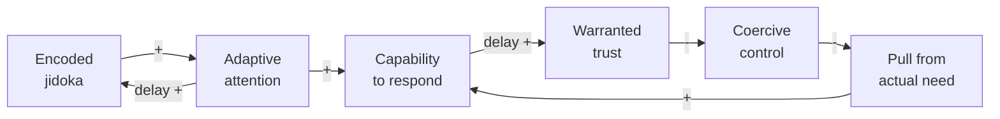
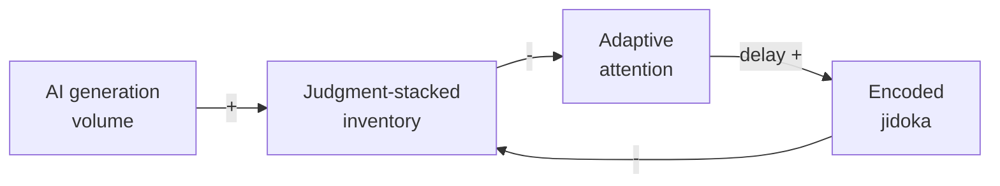

# Freedom and Entrustment

What AI-Augmented Development and LeSS Can Learn from the TPS

Terry Yin · Odd-e

Tokyo LeSS Conference

<!--
The subtitle carries the boundary: this is not a factory recipe applied to
software (Claim 11). We borrow the reasoning with which Toyota made a whole
system responsive and learnable (Claim 1).
-->

---

# About Me

I coach **LeSS** and technical practices at **Odd-e**.

Nearly **30 years** building software, including a decade inside Nokia R&D —
and I still program.

Still programming. Still learning. Now asking what AI should free us from.

Terry Yin · Singapore · terry@odd-e.com

<!--
Lizard makes complexity visible in code; TPS makes abnormalities visible in
a system. This is why I came to TPS through software problems, not as a
manufacturing tourist.

[Sources]
- https://less.works/profiles/terry-yin
- https://github.com/terryyin/lizard
[/Sources]
-->

---
layout: image-right
image: /preaching-to-the-buddha.png
backgroundSize: contain
---

# 釈迦に説法

*Preaching to the Buddha* — sharing about TPS, in Tokyo, at a LeSS
conference.

But TPS has inspired and benefited me so much — before the AI era, and
even more in it — that I cannot resist shamelessly sharing.

- Software is **not a factory** — it mixes discovery and production in
  one evolving product
- So this talk takes TPS as **inspiration and reasoning**, never a recipe
  to apply directly

<!--
Carries the talk boundary up front so it need not repeat later:
Claims 1 (reasoning, not mechanisms) and 11 (software differences).
-->

---
layout: center
class: text-center
---

# One lineage of inspiration

**TPS** inspired **XP** and the Agile movement,

then **LeSS** —

and now, **AI-augmented development**.

---
layout: center
class: text-center
---

## How do you know if the organization is using AI right?

# If the teams are more **freed** than **constrained** by what they built.

<!--
The diagnostic question — one of the first slides (stage setting).
Claim 10.
-->

---
layout: image-right
image: /constrained-by-what-they-built.png
backgroundSize: contain
---

# Constrained by what they built

- Leftover ownership
- Unfinished, judgment-dependent work
- Unable to take the next highest-value item

Being **constrained** ≠ taking **responsibility**

---
layout: statement
---

# AI can produce plausible software faster than a product group can absorb it

A generated branch, test, analysis, or design is not yet capability.
Until it is understood, owned, integrated, and judged, it is **inventory**
someone must supervise or re-judge — teams **constrained** by what they
built.

Or AI helps make the next slice smaller and known failures easier to
prevent or stop — teams **freed** by what they built.

## **AI speeds whichever loop you feed.**

<!--
Sets the AI stage early: this talk is also about AI-augmented development.
Connects back to the diagnostic (freed vs constrained) and forward to the
loops. Loop map: Claim 22; generation cheap / judgment expensive belongs
to the jidoka cluster (Claim 6).
-->

---
layout: section
---

# The apparent tradeoff

<!--
Main message setup: freedom and entrustment mistakenly treated as a tradeoff.
-->

---

# Freedom vs. entrustment?

To hand over the work that matters, it seems you must **constrain** people
in advance.

To give real freedom, it seems you **cannot hand over** the work that
matters.

**Entrust**, 任せる · **trust**, 信頼

<!--
Language contrast for the mixed international / Japanese audience.
TPS shows they reinforce each other instead — next slide. Claim 10.
-->

---
layout: quote
---

> **TPS shows how a system can continually convert learning into constraints
> that make greater freedom responsible — and use that freedom to produce
> the next learning on which deeper entrustment, and then mutual trust,
> can rest.**

<!--
The main message. Claim 10.
-->

---
layout: two-cols-header
---

# Two houses, different layers

::left::

**Toyota's official TPS overview**

Pillars: **Jidoka** · **Just-in-Time**

Toyota's explanation of its operating system
(not labelled a house)

  Source: <a href="https://global.toyota/en/company/vision-and-philosophy/production-system/index.html">Toyota Motor Corporation, “Toyota Production System”</a>

::right::

**Larman & Vodde's Lean Thinking house**

  Larman & Vodde, <em>Scaling Lean and Agile Development</em>, Fig. 3.1 (2009) 
  <a href="https://less.works/resources/graphics/book-images">Creative Commons for presentations via less.works</a>

<!--
Show Toyota's official overview first, then the Larman/Vodde synthesis —
related but different layers, not a taxonomy. Do not present an unsourced
house-shaped TPS diagram as Toyota's. Claim 2.
-->

---

# The triad

- **Jidoka frees** people from watching and re-judging the known
- **JIT entrusts** capable people with responding resourcefully to real need
  instead of stockpiling output in advance
- **Respect for People grows** the people who can think — on whom both depend

Technical excellence keeps the shared product and its abnormalities visible
soon enough for teams to collaborate just in time.

<!--
Claims 3, 12, 8.
-->

---

# The engine of freedom and entrustment

Two reinforcing loops: **jidoka frees** attention; **JIT entrusts** capability.

<!--
The triad drawn as loops — Figure 1 of Claim 22's companion CLD
(R1 encode-and-free, R2 freedom-and-entrustment). Walk it until it
closes: encoded learning frees attention; attention builds capability;
capability earns warranted trust (delayed); trust lowers coercive
control; low control lets actual need pull; pull grows capability.
Claims 22 and 10.
-->

---

# AI speeds whichever loop you feed

AI **raises the gain** on the loop you are already running.

<!--
Figure 2 of Claim 22's companion CLD (R5), overlaying the engine's R1.
Reinforcing, so it runs virtuous or vicious depending on the starting
condition — the DORA 2025 amplifier finding as structure. Reprises the
early statement slide's punchline now that the engine has been walked.
Claim 22.
-->

---
layout: center
class: text-center
---

# Jidoka preserves knowledge

Generation is cheap; **judgment is expensive**.

Encode what we already know.
Leave people able to **experience** the next problem
and **comprehend** the solution.

<!--
Claim 6.
-->

---
layout: image-right
image: /toyoda-type-g-automatic-loom.jpg
backgroundSize: contain
---

# The loom's closed stop

The loom stops itself on a broken thread — nobody watches it.

A **closed stop**: the abnormality halts the work, not a person's vigilance.

  Photo: Daderot, via <a href="https://commons.wikimedia.org/wiki/File:Toyoda_Automatic_Loom_-_National_Museum_of_Nature_and_Science,_Tokyo_-_DSC07343.JPG">Wikimedia Commons</a> · <a href="https://creativecommons.org/publicdomain/zero/1.0/">CC0 1.0</a> 
  Exhibit: National Museum of Nature and Science, Tokyo

<!--
Claim 6 — the founding jidoka story.
-->

---
class: p-0
---

  Watching the loom / watching the AI

<!--
Jidoka frees people from watching and re-judging the known.
Claim 6 — the same judgment-loaded trap in factory and software work.
-->

---
class: p-0
---

  Called by the stop

<!--
The closed stop calls human judgment only when an abnormality needs it.
Claim 6 — the stop preserves freedom while creating an opportunity to learn.
-->

---

# Smart → dumb → gone

Move learned judgment downhill:

1. **Smart:** a person judges
2. **Dumb:** a closed stop or check encodes the judgment
3. **Gone:** prevention — the failure can no longer occur (poka-yoke)

Do not load the system with output that still needs a person to re-judge.

<!--
Claims 6 and 20 (poka-yoke supports jidoka).
Gone: the best part is no part — the failure can no longer occur.
-->

---

# Preferred tests: E2E or unit — nothing in between

Where "dumb" lives in software — tests that hold the encoded judgment:

- A **unit test** drives a stable boundary with crafted data —
  real lower layers, mock only externals
- An **E2E test** asserts a user-valued **state change**, not presentation
- **No commit on red**; unfinished E2E stays `@wip`

A good AI episode leaves **reusable capability** like these —
not a one-off patch.

<!--
Claim 6 — preferred unit/E2E style: the harness text "I" and AI both
read. Worked doughnut examples queued on Claim 13.
-->

---
layout: image-right
image: /andon-pull.png
backgroundSize: contain
---

# Stop & Fix

A detector everyone continues past is only a **dashboard**.

- Stop means stop: fix before flowing on
- Quiet warnings drift into noise — no news is good news only when
  abnormal means stop

  AI-generated illustration

<!--
Claims 19 (Stop & Fix) and 24 (warnings as stop).
-->

---
layout: section
class: p-0
---

  Same gates for "I" and AI

---

# The gates do not care who authored the change

The product standard and stop conditions do not weaken according to
**who or what** wrote it.

After a dumb stop, AI may help fix dumb problems —
it must **not dissolve the stop**.

<!--
Claim 6.
-->

---

# Five judgments stay human

1. **Value**
2. **Design**
3. **Credentials**
4. **Undiagnosed failure**
5. **Ambiguity**

<!--
Claim 6.
-->

---
layout: image-right
image: /entering-ai-harness.png
backgroundSize: contain
---

# Go-See may mean entering the AI harness

Genchi genbutsu when the work happens inside an agent loop:
go to where the work is actually done.

<!--
Claim 16.
-->

---
layout: section
---

# JIT flow in LeSS

---

# Pull, don't stockpile

Start from **one current customer need** →
cut a **thin vertical slice** →
integrate it → confirm quality and usefulness →
take the **next bite**.

<!--
Claims 4 (assurance by resourcefulness, not abundance) and
17 (vertical slicing, one-piece flow).
-->

---

# Continuous integration is a practice, not a system

A CI server that integrates unowned branches is a stockpile with a
green light on it.

<!--
Claim 21.
-->

---

# Let the shared product pull collaboration

- Technical excellence exists so one product group can integrate continuously
- The shared product pulls the right people together, just in time
- Slowing down means **not overproducing** — do not create debt faster

<!--
Claim 8. Nemawashi (Claim 9) and the Ebata teaching (Claim 14) support
these JIT beats.
-->

---

# Respect for People: grow people who can think

Spend freed attention on **comprehension**, **whole-product collaboration**,
**kaizen**, and **teaching** — grow response capability, not output.

The deskilling risk is real: encode the known without losing the ability
to judge the unknown.

<!--
Claims 12 and 3.
-->

---

# Continuous improvement towards perfection

- TPS: **SMED** — changeover so cheap that small batches become rational
- LeSS: an expanding **Definition of Done** as the measure of the same
  improvement

<!--
Claims 18 and 5 (SMED, software changeover, AI-friendly context).
-->

---

# Tensions and honest limits

- Honest CI **versus** disposable prototypes — a real tension pair
- Extreme conditions interrupt JIT
- The Algorithm's family resemblance

<!--
Claims 23, 15, 7.
-->

---

# Takeaways

1. **Judge AI use by freedom** — teams more freed than constrained
2. **Pull, don't stockpile** — thin slices, integrate, confirm, next bite
3. **Smart → dumb → gone** — prefer prevention; otherwise a closed stop,
   and actually Stop & Fix
4. **Same gates for "I" and AI** — five judgments stay human
5. **Integrate continuously; collaborate just in time** — do not create
   debt faster

<!--
The small collection of main points to be useful the following day.
Claims 10, 12, 4, 17, 6, 19, 20, 16, 8.
-->

---
layout: quote
---

> **Encode the known. Stop the abnormal. Free people to learn.
> Entrust a capable response to real need.
> Let visible capability earn mutual trust.**

<!--
Closing — return to the theme.
-->

---
layout: end
class: text-center
---

# Thank you

Terry Yin · Odd-e · terry@odd-e.com
