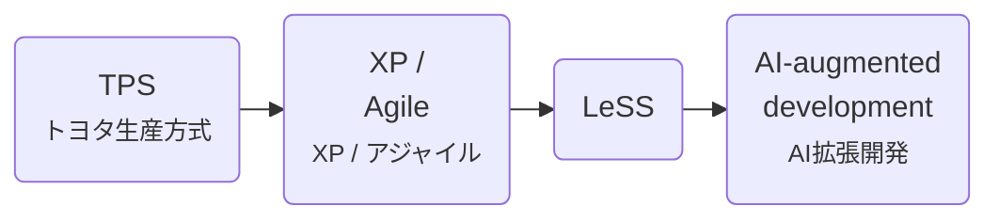
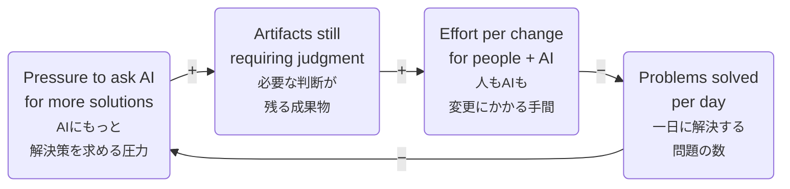
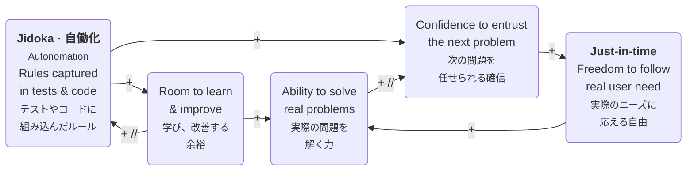

<div class="cover-heading">
  <h1>Freedom <span class="cover-and">and</span><br>Trust</h1>
  <p class="cover-japanese-title" lang="ja">自由と信頼</p>
</div>

<div class="cover-subtitle">
  <p>What AI-Augmented Development<br>Can Learn from the<br>Toyota Production System</p>
  <p class="cover-japanese-subtitle" lang="ja">AI拡張開発がトヨタ生産方式から学べること</p>
</div>

<div class="cover-footer">
  <p class="cover-speaker">Terry Yin <span>· Odd-e</span></p>
  <p class="cover-event">Tokyo LeSS Conference · 2026</p>
</div>

<!--
The subtitle carries the boundary: this is not a factory recipe applied to
software (Claim 11). We borrow the reasoning with which Toyota made a whole
system responsive and learnable (Claim 1).
-->

---

# About Me

[自己紹介]{.ja-title}

I coach **LeSS** and technical practices at **Odd-e**.
[**Odd-e**で**LeSS**と技術プラクティスのコーチをしています。]{.ja}

Nearly **30 years** building software, including a decade inside Nokia R&D —
and I still program.
[ソフトウェア開発は**30年**近く、うち10年はNokiaのR&D。今もプログラムを書いています。]{.ja}

<div class="mt-6 text-xl opacity-70">

Still programming. Still learning. Now asking what AI should free us from.
[今もプログラミングし、学び続けている。いま問うのは、AIが私たちを何から解放すべきか。]{.ja}

</div>

<div class="mt-4 text-lg opacity-60">
Terry Yin · Singapore · terry@odd-e.com
</div>

<!--
Lizard makes complexity visible in code; TPS makes abnormalities visible in
a system. This is why I came to TPS through software problems, not as a
manufacturing tourist.

[Sources]
- https://less.works/profiles/terry-yin
- https://github.com/terryyin/lizard
[/Sources]
-->

---
layout: image-right
image: /preaching-to-the-buddha.png
backgroundSize: contain
class: "[&_li]:!leading-snug"
---

# 釈迦に説法

*Preaching to the Buddha* — TPS in Tokyo.
[TPSを東京で語る。]{.ja}

TPS has helped me. Even more with AI.
[TPSは役立ってきた。AI時代には、なおさら。]{.ja}

- Software combines **discovery and building**.
  [ソフトウェアは、**発見しながら作る**。]{.ja}
- Adapt **TPS thinking** to software.
  [**TPSの考え方**を、ソフトウェアに合わせて活かす。]{.ja}

<!--
Carries the talk boundary up front so it need not repeat later:
Claims 1 (reasoning, not mechanisms) and 11 (software differences).
-->

---
layout: center
class: text-center
---

# One lineage of inspiration

[ひとつながりのインスピレーションの系譜]{.ja-title}


```mermaid {scale: 0.9}
%%{init: {'flowchart': {'rankSpacing': 24, 'nodeSpacing': 20}}}%%
flowchart LR
  TPS(TPS<br><small>トヨタ生産方式</small>)
  XP(XP /<br>Agile<br><small>XP / アジャイル</small>)
  LESS(LeSS)
  AI(AI-augmented<br>development<br><small>AI拡張開発</small>)

  TPS --> XP --> LESS --> AI
  class AI accent
```

**TPS** inspired **XP** and the Agile movement,
[**TPS**が**XP**とアジャイルムーブメントにインスピレーションを与え、]{.ja}

then **LeSS** —
[**LeSS**にも——]{.ja}

and now, **AI-augmented development**.
[そして今、**AI拡張開発**へ。]{.ja}

---
layout: center
class: text-center
---

## How do you know if the organization is using AI right?

[組織がAIを正しく使えているか、どうすればわかる？]{.ja-title}

# If the teams are more **freed** than **constrained** by what they built.

[チームが作ったものに**縛られる**より、**解放されて**いるなら。]{.ja-title}

<!--
The diagnostic question — one of the first slides (stage setting).
Claim 10.
-->

---
layout: image-right
image: /constrained-by-what-they-built.png
backgroundSize: contain
---

# Constrained by what they built

[自ら作ったものに縛られる]{.ja-title}

- Leftover ownership
  [オーナーシップの残骸]{.ja}
- Judgment-loaded output presented as finished
  [必要な判断がされないままのアウトプットを「完成」としてしまう]{.ja}
- Unable to take the next highest-value item
  [次に最も価値の高いアイテムに取りかかれない]{.ja}

Being **constrained** ≠ taking **responsibility**
[**縛られる** ≠ **責任を引き受ける**]{.ja}

---
class: "[&>h2]:!mt-0 [&_p]:!my-2"
---

# Judgment-intensive work

[判断集約型の仕事]{.ja-title}

## Use judgment to discover. **Encode what you learn.**

[判断して見つける。**学びを仕組みにする。**]{.ja-title}

<div class="mt-10 grid grid-cols-2 gap-8 text-[22px] leading-snug">

<div class="border-l-4 border-[#b33a2b] pl-4">

**In a document**
[**文書なら**]{.ja}
“The list must not be empty.”
[「リストは空にしない」]{.ja}

Someone must interpret it.
[誰かが解釈する。]{.ja}

</div>

<div class="border-l-4 border-[#b33a2b] pl-4">

**In a test**
[**テストなら**]{.ja}
Empty list → failure.
[空のリスト → 失敗。]{.ja}

Otherwise, no news.
[問題なければ、何も起きない。]{.ja}

</div>

</div>

<div class="mt-10 rounded bg-[#b33a2b]/10 px-5 py-3 text-[22px] leading-snug">

**The next person need not rediscover the rule.**
[**次の人がルールを見つけ直さずに済む。**]{.ja}

</div>

<!--
Claim 00. Building or improving the product is often anticipated or planned;
Stop & Fix is triggered by an abnormality. Both need live judgment while the
answer is being discovered. When the situation changes what matters or what
counts as good enough, someone must decide in context. The list example shows
what happens after a rule is understood: a document preserves it but asks each
reader to interpret and
apply it; an executable test checks it routinely and signals a violation.
A failing test may still require investigation, but no one needs to decide
again whether an empty list is allowed.
-->

---

# AI speeds whichever loop you feed

[AIは、好循環も悪循環も加速させる]{.ja-title}


```mermaid {scale: 1.1}
%%{init: {'flowchart': {'rankSpacing': 35, 'nodeSpacing': 28}}}%%
flowchart LR
  AI(Pressure to ask AI<br>for more solutions<br><small>AIにもっと<br>解決策を求める圧力</small>)
  INV(Artifacts still<br>requiring judgment<br><small>必要な判断が<br>残る成果物</small>)
  EFF(Effort per change<br>for people + AI<br><small>人もAIも<br>変更にかかる手間</small>)
  DONE(Problems solved<br>per day<br><small>一日に解決する<br>問題の数</small>)

  AI -->|"+"| INV
  INV -->|"+"| EFF
  EFF -->|"−"| DONE
  DONE -->|"−"| AI
  class AI accent
```

<div class="mt-3 text-sm opacity-60">

**+** increases · **−** reduces
[＋ 増やす · − 減らす]{.ja}

</div>

<!--
Figure 2 of Claim 22's companion CLD: R7's reinforcing pressure
trap. Four variables, one loop. This is a qualitative hypothesis about work
on one evolving product with finite people and AI capacity.

Open with: "AI solved my problem!" The immediate solution can be real while
its artifact still leaves judgment for the next person or agent. Artifacts
include working code, tests, designs, and documents; this is not only a pile
of unfinished drafts. The problem is recurring interpretation and decisions
left in their use or change. The slide's artifact variable is the accumulated
amount of that judgment-loaded output, not all artifacts regardless of kind.

Walk the loop: pressure to ask AI for more solutions encourages more
generation. When those solutions leave judgment behind, they add artifacts
that people and AI must understand, reconcile, verify, or repair on the next
change. Effort per change rises. With finite capacity, fewer problems are
solved per day. Poor progress increases pressure to ask AI for still more
solutions, completing the trap. Signs: +, +, −, −; reinforcing.

The final link is a response to poor progress, not a claim that fewer solved
problems automatically create more AI output. It applies when the response
is "ask AI for more solutions." Pressure is distinct from actual AI output:
agents can also slow down as they recover context and retry (B2 in the
companion). The completion variable includes people and AI working together,
so this loop shows the whole system's slowdown, not just a human review queue.

The previous slide offers the first escape: encode a learned rule so both
people and AI need less repeated interpretation. Later TPS slides explain
how to keep changes small, finish them, and preserve the learning. Avoid
implying that every useful act of judgment is waste, or that generated tests
are already trustworthy. Claims 00, 5, 6, and 22.

Doughnut — the notebook product we use in LeSS in Action. A
Cursor-coauthored `/sync` pull lands remote note changes in one commit:
12 files, 558 insertions, on CLI files six authors are sharing that week
(2026-07-27). User-facing, and it ships — but it never becomes a small
stoppable change. Same-day follow-up on that surface is the absorb cost:
Cursor pins `/export` tree and body; Claude then fixes a `/sync`
usage-error spinner. After this episode the group is more constrained by
what they built: generated volume outpaces absorption.
Hashes: `7b61a5705c` (`/sync` pull), `fce957dd3d` (`/export` pin),
`c657c674ad` (`/sync` spinner).
-->

---

# Freedom vs. trust?

[自由 VS 信頼？]{.ja-title}

To hand over the work that matters, it seems you must **constrain** people
in advance.
[大事な仕事を任せるには、あらかじめ人を**制約で縛る**必要があるように見える。]{.ja}

To give real freedom, it seems you **cannot hand over** the work that
matters.
[本当の自由を与えたら、大事な仕事は**任せられない**ように見える。]{.ja}

**Trust people with real work.** · **信頼して任せる**


<!--
Main message setup — the apparent tradeoff: freedom and trust
mistakenly treated as a tradeoff.

Trust here means trusting people with real problems and giving them freedom
and support to respond. Entrusting work expresses that trust; mutual trust
also grows through capable responses. Keep entrust as the precise verb for
giving responsibility. TPS shows how freedom and trust can reinforce each
other — next slide. Claim 10.
-->

---
class: p-0
---

<div class="pointer-events-none absolute left-8 top-0 font-serif text-[150px] leading-none text-[#b33a2b]/10" aria-hidden="true">“</div>

<div class="absolute inset-x-14 bottom-12 top-16 grid grid-cols-[1.65fr_1fr] items-center gap-10">

<blockquote class="!m-0 !border-0 !bg-transparent !p-0 !not-italic text-[29px] font-semibold leading-[1.4]">
  <p class="!m-0 !text-[29px] !leading-[1.4]">
    TPS shows how a system can continually
    <span class="text-[#b33a2b]">convert learning into constraints</span>
    that make greater <span class="text-[#b33a2b]">freedom responsible</span> —
  </p>
  <p class="!mb-0 !mt-5 !text-[29px] !leading-[1.4]">
    and use that freedom to produce the <span class="text-[#b33a2b]">next learning</span>
  </p>
  <p class="!mb-0 !mt-5 !text-[29px] !leading-[1.4]">
    on which deeper <span class="text-[#b33a2b]">entrustment</span>,
    and then <span class="text-[#b33a2b]">mutual trust</span>, can rest.
  </p>
</blockquote>

<div class="border-l border-[#78716c]/30 pl-7 text-[19px] leading-[1.8] text-[#5c564e]" lang="ja">
  <p class="!m-0">
    TPSは、学びを制約に変え、その制約によってより大きな自由を責任あるものにする。その自由で次の学びを生み出す。
  </p>
  <p class="!mb-0 !mt-5">
    その学びを土台に、より深く任せられるようになり、やがて相互の信頼が成り立つ。
  </p>
</div>

</div>

<!--
The main message. Claim 10.
-->

---
layout: two-cols-header
layoutClass: "!grid-rows-[auto_1fr] [&_.col-header_h1]:!mb-2 [&_p]:!leading-snug"
---

# Two houses, different layers

[二つのハウス、異なる階層]{.ja-title}

::left::

**The TPS house**
[TPSハウス]{.ja}

<svg class="mx-auto mt-1 h-[170px] w-full" viewBox="0 0 400 322" role="img" aria-labelledby="tps-house-title tps-house-desc">
  <title id="tps-house-title">The commonly taught TPS house</title>
  <desc id="tps-house-desc">
    Roof: best quality, lowest cost, shortest lead time. Pillars: Jidoka
    and Just-in-Time, with people and kaizen between them. Foundation:
    standardized work, heijunka, and stability.
  </desc>
  <path
    d="M 12 96 L 200 10 L 388 96 Z"
    fill="#292524"
    stroke="#292524"
    stroke-width="2"
    stroke-linejoin="round"
  />
  <g fill="#fffaf3" text-anchor="middle">
    <text x="200" y="42" font-weight="700" style="font-size: 15px">Best quality</text>
    <text x="200" y="56" style="font-size: 10px" opacity="0.8">最高の品質</text>
    <text x="200" y="73" style="font-size: 11px">Lowest cost · Shortest lead time</text>
    <text x="200" y="87" style="font-size: 10px" opacity="0.8">最低のコスト・最短のリードタイム</text>
  </g>
  <rect x="40" y="96" width="320" height="148" fill="#fffaf3" stroke="#78716c" stroke-width="2.5" />
  <line x1="148" y1="96" x2="148" y2="244" stroke="#78716c" stroke-width="2" />
  <line x1="252" y1="96" x2="252" y2="244" stroke="#78716c" stroke-width="2" />
  <g text-anchor="middle">
    <text x="94" y="140" fill="#b33a2b" font-weight="700" style="font-size: 18px">Jidoka</text>
    <text x="94" y="158" class="ja" style="font-size: 12px">自働化</text>
    <text x="94" y="184" fill="#57534e" style="font-size: 11px">
      <tspan x="94">stop at</tspan>
      <tspan x="94" dy="14">abnormality</tspan>
    </text>
    <text x="94" y="217" class="ja" style="font-size: 10px">異常で止まる</text>
    <text x="200" y="146" fill="#292524" font-weight="700" style="font-size: 15px">People</text>
    <text x="200" y="162" class="ja" style="font-size: 12px">人</text>
    <text x="200" y="190" fill="#292524" font-weight="700" style="font-size: 15px">Kaizen</text>
    <text x="200" y="206" class="ja" style="font-size: 12px">改善</text>
    <text x="306" y="138" fill="#b33a2b" font-weight="700" style="font-size: 13px">Just-in-Time</text>
    <text x="306" y="154" class="ja" style="font-size: 10px">
      <tspan x="306">ジャスト・</tspan>
      <tspan x="306" dy="12">イン・タイム</tspan>
    </text>
    <text x="306" y="186" fill="#57534e" style="font-size: 11px">
      <tspan x="306">only what</tspan>
      <tspan x="306" dy="14">is needed</tspan>
    </text>
    <text x="306" y="217" class="ja" style="font-size: 10px">必要なものだけ</text>
  </g>
  <rect x="28" y="244" width="344" height="64" fill="#ece6dc" stroke="#78716c" stroke-width="2.5" />
  <g fill="#292524" text-anchor="middle">
    <text x="200" y="261" font-weight="700" style="font-size: 12px">Standardized work · Heijunka</text>
    <text x="200" y="274" class="ja" style="font-size: 10px">標準作業・平準化</text>
    <text x="200" y="290" fill="#57534e" style="font-size: 12px">Stability</text>
    <text x="200" y="303" class="ja" style="font-size: 10px">安定性</text>
  </g>
</svg>

<p class="mt-2 text-[13px] leading-snug">
  Toyota's <strong>operating system</strong> for making things:
  <strong>Jidoka</strong> builds quality in by stopping;
  <strong>Just-in-Time</strong> makes only what is needed.
  <span class="ja">モノづくりのためのトヨタの<strong>オペレーティングシステム</strong>：<strong>自働化</strong>は止めることで品質を作り込み、<strong>ジャスト・イン・タイム</strong>は必要なものだけを作る。</span>
</p>

<div class="mt-1 text-[9px] leading-tight opacity-70">
  Commonly taught Cho house; structure after Toyota's 1998 TPS booklet.
  Original drawing — not a Toyota asset.
  Pillar meanings:
  <a href="https://global.toyota/en/company/vision-and-philosophy/production-system/index.html">Toyota, “Toyota Production System”</a>
</div>

::right::

**Larman & Vodde's Lean Thinking house**
[Larman & Vodde のリーン思考ハウス]{.ja}


<p class="mt-2 text-[13px] leading-snug">
  A <strong>Toyota Way / lean-thinking</strong> synthesis:
  <strong>Respect for People</strong> and
  <strong>Continuous Improvement</strong>, on managers-as-teachers,
  toward <strong>perfection</strong>.
  <span class="ja"><strong>トヨタウェイ／リーン思考</strong>の統合：教える人としてのマネージャーを土台に、<strong>人間性尊重</strong>と<strong>継続的改善</strong>で<strong>完璧</strong>を目指す。</span>
</p>

<div class="mt-1 text-[9px] leading-tight opacity-70">
  Larman & Vodde, <em>Scaling Lean and Agile Development</em>, Fig. 3.1 (2009)<br>
  <a href="https://less.works/resources/graphics/book-images">Creative Commons for presentations via less.works</a>
</div>

<!--
Show the commonly taught TPS house first (Cho / 1998 booklet structure,
original drawing), then the Larman/Vodde synthesis — related but different
layers. Do not present the left house as Toyota's official graphic. Claim 2.
-->

---

# The triad

[三位一体]{.ja-title}

<svg class="mx-auto mt-1 h-[285px] w-[88%]" viewBox="0 0 900 372" role="img" aria-labelledby="triad-title triad-description">
  <title id="triad-title">Jidoka, Just-in-Time, and Respect for People</title>
  <desc id="triad-description">
    A triangle showing that Jidoka frees attention, Just-in-Time entrusts
    response to real need, and Respect for People grows capability.
  </desc>
  <path
    d="M 450 62 L 155 290 L 745 290 Z"
    fill="none"
    stroke="#78716c"
    stroke-width="3"
    stroke-linejoin="round"
  />
  <g font-family="inherit" text-anchor="middle">
    <g transform="translate(300 165) rotate(-38)">
      <rect x="-82" y="-32" width="164" height="64" rx="24" fill="#ece6dc" />
      <text y="2" fill="#b33a2b" font-weight="700" style="font-size: 28px">frees</text>
      <text y="24" class="ja" style="font-size: 16px">解放する</text>
    </g>
    <text x="350" y="232" fill="#57534e" style="font-size: 16px">attention for real need</text>
    <text x="350" y="251" class="ja" style="font-size: 14px">本当のニーズへの注意を</text>
    <g transform="translate(600 165) rotate(38)">
      <rect x="-82" y="-32" width="164" height="64" rx="24" fill="#ece6dc" />
      <text y="2" fill="#b33a2b" font-weight="700" style="font-size: 28px">grows</text>
      <text y="24" class="ja" style="font-size: 16px">育てる</text>
    </g>
    <text x="555" y="232" fill="#57534e" style="font-size: 16px">capability to respond</text>
    <text x="555" y="251" class="ja" style="font-size: 14px">応える能力</text>
    <g transform="translate(450 290)">
      <rect x="-95" y="-32" width="190" height="64" rx="25" fill="#ece6dc" />
      <text y="2" fill="#b33a2b" font-weight="700" style="font-size: 28px">entrusts</text>
      <text y="24" class="ja" style="font-size: 16px">任せる</text>
    </g>
    <text x="450" y="342" fill="#57534e" style="font-size: 16px">response instead of stockpiles</text>
    <text x="450" y="362" class="ja" style="font-size: 14px">在庫ではなく、応答</text>
    <g transform="translate(450 58)">
      <rect x="-112" y="-40" width="224" height="80" rx="16" fill="#292524" />
      <text y="2" fill="#fffaf3" font-weight="700" style="font-size: 31px">Jidoka</text>
      <text y="28" fill="#fffaf3" opacity="0.8" style="font-size: 19px">自働化</text>
    </g>
    <g transform="translate(155 290)">
      <rect x="-112" y="-40" width="224" height="80" rx="16" fill="#292524" />
      <text y="2" fill="#fffaf3" font-weight="700" style="font-size: 31px">JIT</text>
      <text y="28" fill="#fffaf3" opacity="0.8" style="font-size: 19px">ジャスト・イン・タイム</text>
    </g>
    <g transform="translate(745 290)">
      <rect x="-135" y="-52" width="270" height="104" rx="16" fill="#292524" />
      <text y="-16" fill="#fffaf3" font-weight="700" style="font-size: 25px">Respect for</text>
      <text y="13" fill="#fffaf3" font-weight="700" style="font-size: 25px">People</text>
      <text y="39" fill="#fffaf3" opacity="0.8" style="font-size: 19px">人間性尊重</text>
    </g>
  </g>
</svg>

Technical excellence keeps the shared product and its abnormalities visible
soon enough for teams to collaborate just in time.
[技術的卓越性が、共有プロダクトの異常を早く見えるようにし、チームがジャスト・イン・タイムで協働できるようにする。]{.ja}

<!--
Claims 3, 12, 8.
-->

---
layout: center
class: text-center
---

# Jidoka preserves knowledge

[自働化は知識を保存する]{.ja-title}

Generation is cheap; **judgment is expensive**.
[生成は安く、**判断には多くの労力がかかる**。]{.ja}

Encode what we already know.
Leave people able to **experience** the next problem
and **comprehend** the solution.
[すでにわかっていることは仕組みに組み込む。<br>人が次の問題を**体験し**、その解決を**理解できる**ようにしておく。]{.ja}

<!--
Claim 6.
-->

---
layout: default
---

# The loom's closed stop

[織機の「閉じた停止」]{.ja-title}

<div class="absolute left-[5.5%] top-[26%] w-[43%]">
  <p class="!m-0 !text-[21px] !leading-snug"><strong>Sakichi Toyoda</strong> wanted to ease<br>his mother's work.</p>
  <p class="!mb-0 !mt-1 !text-[15px] !leading-snug text-[#5c564e]" lang="ja">豊田佐吉は、母の織る仕事を楽にしたかった。</p>
  
  <div class="mt-2 flex items-baseline justify-between gap-3 text-[11px] leading-tight text-[#5c564e]">
    <span>Type G automatic loom, 1924</span>
    <span class="text-[8px]">Photo: <a href="https://commons.wikimedia.org/wiki/File:Toyoda_Automatic_Loom_-_National_Museum_of_Nature_and_Science,_Tokyo_-_DSC07343.JPG">Daderot / Wikimedia</a>, <a href="https://creativecommons.org/publicdomain/zero/1.0/">CC0</a></span>
  </div>
</div>

<div class="absolute left-[54%] top-[26%] w-[40.5%] text-center">
  <p class="!m-0 !text-[31px] !leading-snug"><strong>Jidoka</strong> <span class="text-[#5c564e]">/ Autonomation</span></p>
  
  <p class="!mb-0 !mt-3 !text-[23px] !leading-snug">Automation with a <span class="text-[#c33b2b]">human touch</span></p>
  <p class="!mb-0 !mt-1 !text-[17px] !leading-snug text-[#5c564e]" lang="ja">人の知恵を加えた自動化</p>
</div>

<div class="absolute bottom-[6%] left-[5.5%] right-[5.5%] grid grid-cols-2 gap-[6%] border-t border-[#5c564e]/25 pt-4">
  <div>
    <p class="!m-0 !text-[22px] !leading-snug">A broken thread <strong>stops the loom.</strong></p>
    <p class="!mb-0 !mt-1 !text-[17px] !leading-snug text-[#5c564e]" lang="ja">糸が切れると、織機が自ら止まる。</p>
  </div>
  <div>
    <p class="!m-0 !text-[22px] !leading-snug">People are <strong>free from watching.</strong></p>
    <p class="!mb-0 !mt-1 !text-[17px] !leading-snug text-[#5c564e]" lang="ja">人は見張りから解放される。</p>
  </div>
</div>

<!--
Claim 6 — the founding jidoka story.

Sakichi Toyoda watched his mother weave and wanted to make her work easier.
His power looms incorporated devices that stopped on broken or missing
thread, preventing defective cloth and freeing an operator from continuous
machine watching. Toyota identifies those stopping devices as the origin
of jidoka. The Type G, developed in 1924, is the later example pictured;
1924 is not the date when automatic stopping began.

Jidoka is 自働化. The middle character 働 contains 亻 (にんべん / ninben),
the person radical. Only that radical is red in the outlined SVG. Toyota
calls this autonomation, or automation with a human touch: human wisdom
built into the work. The radical does not mean somebody must keep watching.
The mechanism handles the known abnormality; people respond when it stops
and improve the process. The next slide shows that change in attention.

[Sources]
- https://global.toyota/en/company/plant-tours/production-system/
- https://global.toyota/en/company/vision-and-philosophy/production-system/
- https://www.toyota-global.com/company/history_of_toyota/75years/text/taking_on_the_automotive_business/chapter1/section1/item4.html
- https://www.toyota-industries.com/company/history/toyoda_sakichi/
- https://www.jsme.or.jp/kikaiisan/heritage_016_en.html
[/Sources]
-->

---
class: p-0
---


<div v-click.hide="1" class="absolute left-1/2 top-1/2 z-10 -translate-x-1/2 -translate-y-1/2 rounded bg-white/85 px-4 py-2 text-center text-2xl font-semibold">
  Watching the loom / watching the AI
  <span class="ja">織機を見張る／AIを見張る</span>
</div>


<div v-click="1" class="absolute left-1/2 top-1/2 z-10 -translate-x-1/2 -translate-y-1/2 rounded bg-white/85 px-4 py-2 text-center text-2xl font-semibold">
  Called by the stop
  <span class="ja">停止したら呼ばれる</span>
</div>

<!--
Jidoka frees people from watching and re-judging the known.
Claim 6 — the same judgment-loaded trap in factory and software work.

[click] Called by the stop: the closed stop calls human judgment only when
an abnormality needs it. Claim 6 — the stop preserves freedom while
creating an opportunity to learn.
-->

---
layout: default
---

# Smart → dumb → gone

[賢い → 単純 → 消える]{.ja-title}


<div class="absolute bottom-[6%] left-[5.5%] right-[5.5%] grid grid-cols-3 gap-5 text-center">
  <div>
    <p class="!m-0 !text-[25px] !leading-snug font-semibold">Smart</p>
    <p class="!mb-0 !mt-1 !text-[19px] !leading-snug">Judge while creating</p>
    <p class="!mb-0 !mt-1 !text-[15px] !leading-snug text-[#5c564e]" lang="ja">つくるときに判断する</p>
  </div>
  <div>
    <p class="!m-0 !text-[25px] !leading-snug font-semibold">Dumb</p>
    <p class="!mb-0 !mt-1 !text-[19px] !leading-snug">The joint checks the fit</p>
    <p class="!mb-0 !mt-1 !text-[15px] !leading-snug text-[#5c564e]" lang="ja">形が間違いを防ぐ</p>
  </div>
  <div>
    <p class="!m-0 !text-[25px] !leading-snug font-semibold">Gone</p>
    <p class="!mb-0 !mt-1 !text-[19px] !leading-snug">No joint to maintain</p>
    <p class="!mb-0 !mt-1 !text-[15px] !leading-snug text-[#5c564e]" lang="ja">接合部も、その保守もなくす</p>
  </div>
</div>

<div class="absolute bottom-[2%] right-[5.5%] text-[8px] text-[#5c564e]">AI-generated illustration</div>

<!--
Spoken bridge: so that's the jidoka that frees people — but how to build
one? Is AI a good excuse to accumulate loads of judgment-loaded output and
call it done? (Claim 6.)

Claims 00, 6, and 20 (poka-yoke supports jidoka).

Smart here means judgment spent during creation: understand the need,
compare designs, and decide what must hold. We want that intelligence
in the making, with less need to reconstruct those decisions in later use.
Dumb means the result carries the knowledge in a simple, closed mechanism.
The keyed joint is a physical yes/no check. In software, a simple test or
enforced invariant can carry the same previously settled decision.
Gone means the best part is no part. If the joint is unnecessary, a
one-piece design removes it and its assembly question. There is no joint
to inspect or maintain. This is an original conceptual example, not a
historical Toyota device. The one-piece design preserves the needed
function; removing a necessary joint or deleting a still-needed test
would not demonstrate Gone. Other problems may still need judgment.

In software, "dumb" mostly lives in tests that hold the encoded judgment:
a unit test drives a stable boundary with crafted data (real lower layers,
mock only externals); an E2E test asserts a user-valued state change, not
presentation; no commit on red. A good AI episode leaves reusable
capability — not a one-off patch. (Claim 6; e.g. doughnut
`correctAnswerLeavesAGoodRecallLogLinkedToTheAnswer`, `e683b74615`.)

Dumb leftover: `RecallStatsPerformanceTest` — production timed out at
~200 answered recalls (native `SELECT rp.*` hydrated each prompt's
eager associations). The stop is `getPrepareStatementCount()`
`lessThan(10L)` while `compute()` still returns 200 reviews. Hash:
`0bd1dd2995`.

Gone leftover: write DTOs (`NoteUpdateTitleDTO`, `FolderCreationRequest`,
`FolderRenameRequest`, `NotebookUpdateRequest`) carry
`@Pattern(regexp = DisplayNamePathSeparators.REGEXP)` so
`\ / : * ? " < > |` cannot be authored. Hashes: `dfbde33184` /
`55e5e55edc` / `445656f73a`.
-->

---
layout: default
---

# Dumb: the rule becomes a stop

[単純：判断を停止の仕組みに組み込む]{.ja-title}

<div class="absolute left-[5.5%] top-[27%] aspect-video w-[67%]">
  
  <video v-click="1" muted loop playsinline autoplay src="/loom-warp-stop.mp4" class="absolute inset-0 h-full w-full object-contain" aria-label="Animated loom warp stop: the thread breaks, the dropper falls, and the blocked bar triggers a stop."></video>
</div>

<div class="absolute right-[5.5%] top-[27%] w-[19.5%]">
  
  <div class="mt-1 text-[8px] leading-tight text-[#5c564e]">Photo: <a href="https://www.allaboutlean.com/jidoka-3/model-g-warp-break-stop/">Christoph Roser</a><br><a href="https://creativecommons.org/licenses/by-sa/4.0/">CC BY-SA 4.0</a></div>
  <div class="mt-7">
    <p class="!m-0 !text-[19px] !leading-snug font-semibold">Thread intact: run</p>
    <p class="!mb-0 !mt-1 !text-[15px] !leading-snug text-[#5c564e]" lang="ja">糸が張ると動く</p>
  </div>
  <div class="mt-5">
    <p class="!m-0 !text-[19px] !leading-snug font-semibold text-[#b33a2b]">Thread broken: stop</p>
    <p class="!mb-0 !mt-1 !text-[15px] !leading-snug text-[#5c564e]" lang="ja">糸が切れると止まる</p>
  </div>
</div>

<div class="absolute bottom-[2%] left-[5.5%] text-[8px] text-[#5c564e]">Schematic illustration / 模式図</div>

<!--
One click replaces the large before/after still with the existing silent
looping animation. The real Type G close-up anchors the schematic.

The loom is powered. Thread tension holds a dropper up; a break lets it
fall into an oscillating detection bar's path. Blocking the bar activates
the stopping mechanism. Detection does not diagnose or repair the break.
The prior decision is what counts as abnormal and must stop the work.
The mechanism executes that closed decision. This demonstrates Dumb;
the break still exists, so it does not demonstrate Gone.

[Sources]
- https://www.tcmit.org/vgt/textile/english/scene-10-iframe/target-04/
- https://www.tcmit.org/vgt/textile/english/scene-13-iframe/target-03/
- https://www.toyota-global.com/company/history_of_toyota/75years/text/taking_on_the_automotive_business/chapter1/section1/item4.html
- https://www.allaboutlean.com/jidoka-3/model-g-warp-break-stop/
[/Sources]
-->

---
class: "[&>h1]:!mb-2"
---

# Build the stop into the software

[ソフトウェアに「止まる仕組み」を組み込む]{.ja-title}

<div class="absolute left-[6%] top-[30%] h-[49%] w-[88%]">
  <svg viewBox="0 0 880 290" class="h-full w-full" role="img" aria-label="Human or AI changes run through the same tests and checks. Passing checks allow work to continue. Failing checks stop the work so people can fix the cause and encode their learning in the checks.">
    <defs>
      <marker id="software-check-arrow" viewBox="0 0 10 10" refX="9" refY="5" markerWidth="7" markerHeight="7" orient="auto-start-reverse"><path d="M 0 1 L 9 5 L 0 9" fill="none" stroke="#78716c" stroke-width="1.5" /></marker>
      <marker id="software-stop-arrow" viewBox="0 0 10 10" refX="9" refY="5" markerWidth="7" markerHeight="7" orient="auto-start-reverse"><path d="M 0 1 L 9 5 L 0 9" fill="none" stroke="#b33a2b" stroke-width="1.5" /></marker>
    </defs>
    <g fill="#292524" font-family="inherit">
      <text x="104" y="76" text-anchor="middle" style="font-size: 26px" font-weight="600">A change</text>
      <text x="104" y="104" text-anchor="middle" style="font-size: 17px" fill="#5c564e">Human or AI</text>
      <text x="104" y="129" text-anchor="middle" style="font-size: 16px" fill="#5c564e" lang="ja">人もAIも</text>
      <path d="M 190 84 H 254" fill="none" stroke="#78716c" stroke-width="2" marker-end="url(#software-check-arrow)" />
      <rect x="255" y="30" width="228" height="112" rx="4" fill="#fffaf3" stroke="#78716c" stroke-width="1.5" />
      <text x="369" y="68" text-anchor="middle" style="font-size: 26px" font-weight="600">Tests &amp; checks</text>
      <text x="369" y="96" text-anchor="middle" style="font-size: 17px" fill="#5c564e">Rules we know</text>
      <text x="369" y="123" text-anchor="middle" style="font-size: 16px" fill="#5c564e" lang="ja">既知のルールを実行</text>
      <path d="M 483 84 H 545 V 59 H 633" fill="none" stroke="#78716c" stroke-width="2" marker-end="url(#software-check-arrow)" />
      <text x="581" y="39" text-anchor="middle" style="font-size: 15px" fill="#5c564e">Pass / 合格</text>
      <text x="665" y="67" style="font-size: 27px" font-weight="600">Continue</text>
      <text x="665" y="94" style="font-size: 16px" fill="#5c564e" lang="ja">そのまま進む</text>
      <path d="M 545 84 V 179 H 633" fill="none" stroke="#b33a2b" stroke-width="2.5" marker-end="url(#software-stop-arrow)" />
      <text x="566" y="148" style="font-size: 15px" fill="#b33a2b">Fail / 不合格</text>
      <text x="665" y="188" style="font-size: 31px" font-weight="700" fill="#b33a2b">Stop &amp; Fix</text>
      <text x="665" y="216" style="font-size: 17px" fill="#b33a2b" lang="ja">止めて、直す</text>
      <path d="M 745 233 V 253 H 369 V 153" fill="none" stroke="#78716c" stroke-width="2" marker-end="url(#software-check-arrow)" />
      <text x="543" y="281" text-anchor="middle" style="font-size: 17px" fill="#5c564e">Encode what we learn / 学びをコードに</text>
    </g>
  </svg>
</div>

<div class="absolute bottom-[5%] left-[6%] right-[6%]">
  <p class="!m-0 !text-[30px] !leading-tight font-semibold">Fix the cause. Leave a safeguard.</p>
  <p class="!mb-0 !mt-1 !text-[18px] !leading-snug text-[#5c564e]" lang="ja">原因を直す。次を守る仕組みを残す。</p>
</div>

<!--
Claims 6, 19, 24 — the software translation of the loom's closed stop.
Same product standard and checks for human- and AI-authored changes.
Checks must actually run; silence without execution is not assurance.

The diagram follows one change. Normal operation continues without
someone repeatedly judging an already settled rule. When a check fails,
the abnormality becomes current work. People contain it, diagnose and
fix the cause; AI may help. Capture the newly understood rule in a test,
type, invariant or simpler mechanism where appropriate. The return arrow
is deliberate learning, not an automatic rule writer or a guarantee that
every novel problem can be encoded.

Software examples for speaking, removed from the crowded table:
- Tests: a known scenario no longer holds; address the failing test now.
- Fail-fast: expose an illegal state immediately rather than swallow it.
- CI: restore the integrated product to its agreed working state.
- A noticed anomaly or known bug is the human cord: make it current work.

Stop & Fix uses the same context-sensitive judgment as building something
new, now to contain an emergent problem. A check identifies a violation;
it does not automatically diagnose or repair the cause.

Autonomation and the cord are both jidoka. The loom showed the closed
mechanical stop; this slide translates it into software. People may
also signal a noticed anomaly directly, without waiting for a check.

Stop & Fix is the culture of actually responding: halt, contain, fix,
prevent recurrence. Jidoka only **shows** the problem; **culture**
decides whether people actually halt. Courage to stop, contain, fix,
and prevent recurrence — not work around the signal. Stopping first is
the most efficient way.

Liker: Toyota Way *culture* of stopping to fix (2004 Principle 5;
2021 Principle 6) — rapid support to contain, then solve.

LeSS CI: “DO stop and fix” when the build breaks; fixing the broken
build is first priority.

Who stops: the people who broke it stop and fix; everyone else stops
pushing to trunk until it is green — not a plant-wide freeze.

Spoken dashboard contrast (Claim 24): doughnut leftover Biome
`"warn"` pile — `biome.json` / `frontend/biome.json` park rules as
`"warn"`; the CI lint command does not pass `--error-on-warnings`;
Gradle has no warnings-as-errors. A new `debugger` or unused TS
binding can print and the job stays green. The detector ran;
everyone continues past it. Contrast `@focus` in features
(`check_focus_tags.sh` exits 1). HEAD `e683b74615`.

[Sources]
- https://global.toyota/en/company/vision-and-philosophy/production-system/
- https://less.works/less/technical-excellence/continuous-integration
[/Sources]
-->

---
class: "[&>h1]:!mb-2"
---

# Jidoka frees people

[自働化は、人を自由にする]{.ja-title}

<div class="absolute left-[6%] top-[30%] w-[31%]">
  <p class="!m-0 !text-[23px] !leading-snug font-semibold">Known rules<br>protect the product.</p>
  <p class="!mb-0 !mt-2 !text-[17px] !leading-snug text-[#5c564e]" lang="ja">既知のルールが<br>プロダクトを守る。</p>
</div>

<div class="absolute left-[44%] top-[29%] w-[49%]">
  <p class="!m-0 !text-[33px] !leading-tight font-semibold text-[#b33a2b]">Free to solve<br>the next real problem.</p>
  <p class="!mb-0 !mt-2 !text-[19px] !leading-snug text-[#5c564e]" lang="ja">次の本当の課題に、力を使える。</p>
</div>

<div class="absolute bottom-[2%] left-[12%] h-[47%] w-[76%] overflow-hidden">
  
</div>

<!--
Claims 3, 6 and 10 — Terry's interpretation: Jidoka frees people by
enabling them. This formulation is not a quotation from Toyota.

Speak the causal bridge: our judgment discovers a useful rule; tests and
code preserve it; the product can protect that known condition without
continuous watching or rediscovery. This releases attention and gives
people a reliable basis for taking responsibility for the next problem.
They can explore, learn and improve with the user. Freedom here includes
the ability and authority to stop and respond when something is wrong.

The illustration shows healthy checks, not a red failure being ignored.
Safeguards are bounded by what we know, run and own. They do not promise
that all user needs, unknown failures or design choices are automated.
People continue to own both the checks and the product.

Toyota describes abnormality detection and automatic stopping as removing
the need to continuously watch normal operation, with people's knowledge
incorporated into equipment and kaizen. The software extension here is
our argument: executable knowledge enables attention for new work.

Same gates for "I" and AI, now shown on the preceding slide.

Quiet / leftover warning: Claim 24 — unpaid judgment; silence is
trusted only when the check ran. Heuristic, not a TPS slogan; do
not present -Werror as TPS.

Episode leftover: execution Jidoka on doughnut
`.planning/quick/001-morning-cognitive-index/PLAN.md` slice 6
(*A detour into a note is recorded separately*). Stop:
`0b56ebc81a` — no mid-question note affordance; PLAN.md says
**Do not guess the UX** and waits. Author Terry Yin (no Cursor
trailer). Person: `a24d4141b2` — leave RecallPage, return via
Resume. Cursor: `f078923b63` implements detour time (feature +
tests) without deleting or `@wip`-away the stop.

Spoken counter: `a2060f1d70` disabled two backend tests to pass
the pipeline (re-enable `ee9ca9aa68` / `29712022b1`) — dissolve
the stop to green; the opposite of this episode.

The former on-slide recall-to-note example is a speaking detail:
the agent reached an unresolved UX choice and stopped rather than guess.
Terry chose to leave recall and return via Resume; Cursor then implemented
the choice and tests. That owned decision enabled progress. The detailed
plan excerpt is omitted from the slide so the ending lands on freedom.

[Sources]
- https://global.toyota/en/company/vision-and-philosophy/production-system/
[/Sources]
-->

---
layout: image-right
image: /entering-ai-harness.png
backgroundSize: contain
class: "[&>h1]:!mb-2 [&_p]:!my-2 [&_.slidev-code-wrapper]:!my-2 [&_pre]:!text-[13px] [&_pre]:!leading-snug [&_pre]:!py-1"
---

# Go-See may mean entering the AI harness

[現地現物 (Go-See) とは、AIハーネスの中に入ることかもしれない]{.ja-title}

Genchi genbutsu when the work happens inside an agent loop:
go to where the work is actually done.
[仕事がエージェントループの中で起きるときの現地現物：実際に仕事が行われている場所へ行く。]{.ja}

<div class="doughnut-example">

`git commit` reports success. The pre-commit hook records the **main** tree.
[`git commit` は成功を報告する。だがpre-commitフックが記録しているのは**main**のツリーだ。]{.ja}

```bash
REPO_ROOT="$HOOK_DIR/../.."
REPO_ROOT="$(git rev-parse --show-toplevel)"
```

</div>

<!--
Claim 16 (supporting) — a secondary, qualified beat after the same gates:
Go-See means firsthand facts; for AI work it *may* mean entering the
harness. One example, not a general rule.

Leftover: doughnut `scripts/git-hooks/pre-commit`. `$HOOK_DIR/../..`
resolves to the **main** checkout — the hook lives in shared
`.git/hooks`. Hash: `1c696d455d` (`git rev-parse --show-toplevel`).

Spoken callback: the P1 N+1 leftover on *Smart → dumb → gone* is
what later landed once the tree was true — `0bd1dd2995`.
-->

---
class: "[&>h1]:!mb-2"
---

# Just-in-Time

[ジャスト・イン・タイム]{.ja-title}

<div class="absolute left-[6%] right-[6%] top-[25%] grid grid-cols-3 gap-6 text-center">
  <div>
    <p class="!m-0 !text-[25px] !leading-tight font-semibold">Only what is needed</p>
    <p class="!mb-0 !mt-2 !text-[18px] !leading-snug text-[#5c564e]" lang="ja">必要なものを</p>
  </div>
  <div>
    <p class="!m-0 !text-[25px] !leading-tight font-semibold">When it is needed</p>
    <p class="!mb-0 !mt-2 !text-[18px] !leading-snug text-[#5c564e]" lang="ja">必要なときに</p>
  </div>
  <div>
    <p class="!m-0 !text-[25px] !leading-tight font-semibold">The amount needed</p>
    <p class="!mb-0 !mt-2 !text-[18px] !leading-snug text-[#5c564e]" lang="ja">必要な量だけ</p>
  </div>
</div>

<div class="absolute left-[6%] right-[6%] top-[38%] grid grid-cols-3 gap-6 text-center">
  <div>
    
    <p class="!mb-0 !mt-3 !text-[22px] !leading-tight font-semibold">Order 2 cars</p>
    <p class="!mb-0 !mt-1 !text-[16px] !leading-snug text-[#5c564e]" lang="ja">2台の注文</p>
  </div>
  <div>
    
    <p class="!mb-0 !mt-3 !text-[22px] !leading-tight font-semibold">Pull 8 wheels</p>
    <p class="!mb-0 !mt-1 !text-[16px] !leading-snug text-[#5c564e]" lang="ja">車輪8個を引き取る</p>
  </div>
  <div>
    
    <p class="!mb-0 !mt-3 !text-[22px] !leading-tight font-semibold">Replenish 8 wheels</p>
    <p class="!mb-0 !mt-1 !text-[16px] !leading-snug text-[#5c564e]" lang="ja">車輪8個を補充する</p>
  </div>
</div>

<svg viewBox="0 0 900 210" class="absolute left-[4%] top-[38%] h-[38%] w-[92%] pointer-events-none" role="img" aria-label="Customer demand pulls vehicle assembly, which pulls replenishment of the required wheels from the preceding process.">
  <defs><marker id="jit-demand-arrow" viewBox="0 0 10 10" refX="9" refY="5" markerWidth="7" markerHeight="7" orient="auto"><path d="M 0 1 L 9 5 L 0 9" fill="none" stroke="#b33a2b" stroke-width="1.5" /></marker></defs>
  <path d="M 288 105 H 334" fill="none" stroke="#b33a2b" stroke-width="2.5" marker-end="url(#jit-demand-arrow)" />
  <path d="M 579 105 H 625" fill="none" stroke="#b33a2b" stroke-width="2.5" marker-end="url(#jit-demand-arrow)" />
</svg>

<div class="absolute bottom-[3%] left-[6%]">
  <p class="!m-0 !text-[21px] !leading-tight font-semibold">Minimum stock. Steady flow.</p>
  <p class="!mb-0 !mt-1 !text-[15px] !leading-snug text-[#5c564e]" lang="ja">必要最小限の在庫で、流れをつなぐ。</p>
</div>

<div class="absolute bottom-[2%] right-[5%] text-[10px] text-[#5c564e]">
  <a href="https://global.toyota/en/company/vision-and-philosophy/production-system/">Toyota: Toyota Production System</a>
</div>

<!--
Claims 3, 4 and 17. This slide establishes Toyota's operational definition
before Terry's people-side interpretation and the software translation.

Start with the customers: each of two customers wants one car. Assembly
therefore needs eight road wheels for those two vehicles. The assembly
process pulls that quantity from ready stock, and wheel preparation
replenishes the eight used. The supplier vignette contains exactly eight:
seven ready wheels and one being assembled. The displayed quantities are
for a simplified example period, not a Toyota kanban container size or an
actual production schedule. Four road wheels per car; spare wheels are
outside this illustrative count.

The red arrows carry need upstream, reading left to right: customers,
vehicle assembly, wheel preparation. Physical parts and completed vehicles
flow the other way. The small ready stock and replenishment loop remain
essential: the picture does not mean that every part starts from scratch
only after a customer's order. The second scene is the normal wheel-fitting
stage, not a production line deliberately waiting for a shortage.

These are conceptual vignettes, not a specific Toyota plant or its exact
card system. The examples make demand and the required quantity visible;
Toyota's actual system synchronizes timing as well as quantity.

Toyota describes synchronized processes with minimum ready stocks and
replenishment before the next withdrawal. Thus JIT does not mean making
all 30,000 parts only after receiving a car order, nor simply removing all
inventory. Make to actual need, at the pace of demand, and stop after the
needed quantity. Continuous flow, pull, takt, leveling and dependable
processes work together; the replenishment example introduces one part
of that system, not a complete implementation recipe.

Misunderstandings to demystify aloud: producing early or faster merely to
keep everyone busy creates overproduction. The point is a dependable,
coordinated response when needed. Low inventory is supported by capability,
quality and reliable replenishment, not by hoping everything will go well.
Claim 4 owns mixed-model capability and cheap changeover; keep those
internals available in the notes rather than crowding the introduction.

[Sources]
- https://global.toyota/en/company/vision-and-philosophy/production-system/
- https://global.toyota/en/company/plant-tours/production-system/
[/Sources]
-->

---
class: "[&>h1]:!mb-2"
---

# JIT entrusts people

[JITは、応える仕事を人に任せる]{.ja-title}

<div class="absolute left-[6%] top-[31%] w-[34%]">
  <p class="!m-0 !text-[34px] !leading-tight font-semibold text-[#b33a2b]" lang="ja">ある物で工夫する</p>
  <p class="!mb-0 !mt-4 !text-[27px] !leading-snug font-semibold">Be resourceful<br>with what you have.</p>
</div>


<div class="absolute bottom-[6%] left-[6%] right-[6%]">
  <p class="!m-0 !text-[28px] !leading-tight font-semibold">Confidence comes from the ability to respond.</p>
  <p class="!mb-0 !mt-1 !text-[18px] !leading-snug text-[#5c564e]" lang="ja">応える力が、任せる確信になる。</p>
</div>

<div class="absolute bottom-[2%] left-[6%] text-[11px] text-[#5c564e]">Terry’s reading of JIT, inspired by Kazumasa Ebata’s teaching</div>

<!--
Claims 3, 4, 10 and 14. A self-contained, movable people-side companion
to the operational definition of Just-in-Time. This is Terry's reading,
not Toyota's definition or a Toyota/Ohno quotation.

ある物で工夫する — aru mono de kufū suru — means be resourceful with
what you have. Kazumasa Ebata shared this teaching with Terry. Claim 14
records the exact line, the oral source and the limits of the published
corroboration. The parenthetical interpretations in those notes are Terry's.

Story: a customer needs to get a loaded cart through a raised doorway.
The people close to the problem see the actual obstacle. They collaborate,
use the materials already available, and fit and check a simple ramp.
The illustration is an analogy for resourceful response, not a Toyota
assembly operation. The useful response grows from firsthand facts and
competence, rather than a stockpile of imagined answers.

The JIT connection is entrusting capable people close to the work to meet
actual need, using and improving the system's ability to respond. It is
not a promise that scarcity automatically creates ingenuity, or permission
to abandon standards, quality or support. Toyota's reliable processes,
visible pull signals, jidoka, kaizen and collaboration make this response
credible. Claim 4 names operational readiness; it does not claim all
workers in a JIT implementation necessarily feel safe or trusted.

Software bridge: the next slide pulls one current user need. The team can
reuse existing code and tools, investigate the situation, collaborate,
and adapt a small verified response. AI can help with that current work.
The product standard and owned checks still apply. Entrust the response;
do not substitute a pile of generated solutions for capability.

[Sources]
- Local Claim 3: 03-jidoka-enables-jit-trusts-respect-grows.md
- Local Claim 4: 04-jit-assurance-resourcefulness-not-abundance.md
- Local Claim 14: 14-ebata-jit-teaching-in-print.md
- Kazumasa Ebata, oral teaching to Terry Yin; not a published Toyota source.
- https://global.toyota/en/company/vision-and-philosophy/production-system/
[/Sources]
-->

---
layout: image-right
image: /thin-vertical-slice.png
backgroundSize: contain
---

# Pull, don't stockpile

[プルせよ、溜め込むな]{.ja-title}

Start from **one current customer need** →
cut a **thin vertical slice** →
integrate it → confirm quality and usefulness →
take the **next bite**.
[**１つの顧客ニーズ**から始め → **薄い縦斬りスライス**を切り出し → 統合し → 品質と有用性を確かめ → **次の一口**へ。]{.ja}

**Continuous integration is a practice, not a system:** a CI server that
integrates unowned branches is a stockpile with a green light on it.
[**継続的インテグレーションはシステムではなく、プラクティスだ：** 誰も所有しないブランチを統合するCIサーバーは、緑のランプがついた在庫にすぎない。]{.ja}

<!--
Opens JIT flow in LeSS.

Claims 4 (assurance by resourcefulness, not abundance) and
17 (vertical slicing, one-piece flow). Claim 21 — CI is a developer
practice; a CI service is not CI.
-->

---
class: "[&>h1]:!mb-2"
---

# Let the shared product pull collaboration

[共有プロダクトに、協働をプルさせる]{.ja-title}

<div class="absolute left-[4%] top-[25%] w-[92%] aspect-[8/3]">
  
  <svg viewBox="0 0 2048 768" class="absolute inset-0 h-full w-full pointer-events-none" aria-hidden="true">
    <defs>
      <marker id="collaboration-pull-arrow" markerWidth="8" markerHeight="8" refX="6" refY="4" orient="auto">
        <path d="M0,0 L8,4 L0,8" fill="none" stroke="#b33a2b" stroke-width="1.6" />
      </marker>
      <marker id="collaboration-return-arrow" markerWidth="8" markerHeight="8" refX="6" refY="4" orient="auto">
        <path d="M0,0 L8,4 L0,8" fill="none" stroke="#78716c" stroke-width="1.6" />
      </marker>
    </defs>
    <path d="M 982,483 C 1035,483 1030,430 1095,448" fill="none" stroke="#b33a2b" stroke-width="4" marker-end="url(#collaboration-pull-arrow)" />
    <path d="M 1086,604 C 1010,635 1020,497 1035,430" fill="none" stroke="#78716c" stroke-width="3.5" marker-end="url(#collaboration-return-arrow)" />
  </svg>
</div>

<div class="absolute bottom-[4%] left-[5.5%] right-[5.5%] text-center">
  <p class="!m-0 text-[25px] font-semibold">Integrate continuously. Collaborate just in time.</p>
  <p class="!mb-0 !mt-1 text-[17px] text-[#5c564e]">継続的に統合し、必要なときに協働する。</p>
</div>

<!--
Claim 8. Nemawashi (Claim 9) and the Ebata teaching (Claim 14) support
these JIT beats. G19 (ukiyo-e panorama) is the integration–coordination
overlap.

Walk the picture left to right: one customer needs one lantern that is
both bright and wind resistant. Two teams change one shared product.
The upper pair integrates black A B first; the lower mob's later A C
conflicts at A. The red stop calls the relevant five people together.
They resolve the dependency directly and integrate one coherent result.
The red arrow pulls collaboration; the stone return arrow closes integration.
The customer need is the source of pull, not a manager allocating parts.

Technical excellence enables the whole product group to integrate
continuously. A meaningful stop is productive: make the abnormality
current work before more output inherits it. Do not stockpile changes
or create debt faster. This does not prohibit useful earlier refinement
or design conversations; integration makes a concrete dependency visible
and pulls the people needed to resolve it.

Optional spoken example, removed from the slide: Cursor, January 2026,
extract a child note from a checklist point. The shared recall screen
(`Assimilation.vue`) records a conflict leftover; lint stops an unused
import; the user sees a loading modal while the child is created.

Chain: `c2d800a378` (AI-tool infra) → `6f54cc1bd1` (extract-to-child
API) → `9eb162a918` (E2E/type; body records `# Conflicts:
frontend/src/components/recall/Assimilation.vue`) → `b62b0a183b`
(lint stop: unused `NoteCreationController` import) → user-visible
`0a60a9cbfb` (LoadingModal while creating a child from a checklist
point). Same afternoon `34e121906e` / `bdc83aaa78` also edited
`Assimilation.vue`.

Spoken callback: the `/sync` beat on *AI speeds whichever loop you feed* —
this January chain is the same kind of tool
kept small and stoppable, the **freed** pole of that contrast. Do
not retell the July `/sync` episode.

Spoken backup if January drops: item 1 P2 — Claude restores note
properties on a shared export (`c4f5098c5e` / `b03ac76f8a`).
-->

---

# The engine of freedom and trust

[自由と信頼のエンジン]{.ja-title}

<div class="absolute left-[5.5%] right-[5.5%] top-[25%]">


```mermaid {scale: 0.9}
%%{init: {'flowchart': {'rankSpacing': 28, 'nodeSpacing': 25}}}%%
flowchart LR
  EJ(<b>Jidoka · 自働化</b><br><small>Autonomation</small><br>Rules captured<br>in tests & code<br><small>テストやコードに<br>組み込んだルール</small>)
  AA(Room to learn<br>& improve<br><small>学び、改善する<br>余裕</small>)
  CAP(Ability to solve<br>real problems<br><small>実際の問題を<br>解く力</small>)
  WT(Confidence to entrust<br>the next problem<br><small>次の問題を<br>任せられる確信</small>)
  PULL(<b>Just-in-time</b><br>Freedom to follow<br>real user need<br><small>実際のニーズに<br>応える自由</small>)

  EJ -->|"+"| AA
  AA -->|"+ //"| EJ
  AA -->|"+"| CAP
  EJ -->|"+"| WT
  CAP -->|"+ //"| WT
  WT -->|"+"| PULL
  PULL -->|"+"| CAP
  class AA,PULL accent
```

</div>

<div class="absolute bottom-[5%] left-[5.5%] text-[11px] opacity-60">

**+** increases · **//** takes time
[＋ 増やす · // 時間がかかる]{.ja}

</div>


<div class="absolute bottom-[2%] right-[5.5%] text-[8px] opacity-50">AI-generated illustration</div>

<!--
Figure 1 of Claim 22's companion CLD: R1 and R2 in five plain-language
variables. The title is unchanged. The two red nodes show substantive
freedom: room to learn and the ability to follow the next real user need.
The endpoints explicitly name Jidoka (autonomation, 自働化) and Just-in-time.
The level scale answers slide 9's tilted balance: the automatic stop frees
attention; the single part and pull card represent entrusting a response to
actual need. They support one another rather than requiring a tradeoff.

Start with the list example from slide 7. A rule in a test carries a judgment
already made. People and AI need less repeated interpretation, leaving room
to investigate and improve. If that room is used to learn, more rules can be
captured in tests, code, and prevention designs over time. That closes R1.
More generated tests alone do not produce this effect: checks must be owned,
trustworthy, and used as real stops.

The direct rules-to-confidence arrow adds a second basis for entrustment:
reliable, owned safeguards carry known judgments and stop known mistakes.
That confidence complements demonstrated capability to handle new problems;
it is not a promise that every generated test or every new rule deserves trust.

That same room helps the team grow its ability to solve real problems.
Visible, responsible results earn confidence to entrust the next problem;
this takes time. Confidence reduces advance approvals and imposed solution
plans, giving the team freedom to respond to the next real user need. Doing
that work with support grows capability further. That closes R2.

The positive confidence-to-freedom arrow condenses two canonical negative
links: warranted trust reduces coercive control; coercive control restricts
pull from actual need. It does not mean abandoning quality gates, necessary
planning, or accountability. The freedom node means those constraints no
longer force work around leftover ownership, inventory, or external control.

Contrast slide 8: there, more artifacts leave more repeated judgment and
pressure for more output. Here, learned rules carry the judgment forward,
and freed attention grows the capability to take the next valuable work.
Claims 3, 6, 10, and 22.
-->

---

# Respect for People: making things means making people

[人間性尊重：モノづくりは人づくり]{.ja-title}

Spend freed attention on **comprehension**, **whole-product collaboration**,
**kaizen**, and **teaching** — grow response capability, not output.
[解放された注意を**理解**、**プロダクト全体での協働**、**改善**、**教えること**に使う——育てるのはアウトプットではなく、応える能力だ。]{.ja}

The deskilling risk is real: encode the known without losing the ability
to judge the unknown.
[スキル低下のリスクは現実にある：既知を仕組みに組み込みつつ、未知を判断する力を失わないこと。]{.ja}

<!--
Claims 12 and 3.
-->

---

# Continuous improvement towards perfection

[完璧に向けた継続的改善]{.ja-title}

- TPS: **SMED** — changeover so cheap that small batches become rational
  [TPS：**SMED**（シングル段取り）——段取り替えの負担を減らし、少量生産を合理的にする]{.ja}
- LeSS: an expanding **Definition of Done** as the measure of the same
  improvement
  [LeSS：**完成の定義**の拡張も、同じ改善の尺度となる]{.ja}


<!--
Claims 18 and 5 (SMED, software changeover, AI-friendly context).

Spoken follow-on — lower the switching cost: change direction at
relatively low cost; leftover of that *is* switching cost (TPS:
changeover). SMED, then OTED — single-digit minutes, then one remaining
touch. Software stack: common repo → trunk-based development → one-touch
env setup → fast deterministic e2e.
-->

---

# Tensions and honest limits

[緊張関係と、正直な限界]{.ja-title}

- Honest CI **versus** disposable prototypes — a real tension pair
  [正直なCI **対** 使い捨てのプロトタイプ——本当の緊張関係]{.ja}
- The Algorithm resembles TPS — a family resemblance, not a proven
  extension
  [「アルゴリズム」はTPSに似ている——家族的類似であって、実証された発展形ではない]{.ja}


<!--
Claim 23 carries the tension: honest CI seeks complete integration-cycle
feedback; a disposable prototype seeks cheap learning outside the product.
Both are good ideas; each limits the other.

Claim 7 (supporting, qualified aside): the Algorithm's operating logic
resembles TPS and lean; direct derivation from TPS is unproven.
-->

---
class: "text-center [&>h1]:!text-[26px] [&>h1]:!mb-2"
---

# How do you know if the organization is using AI right?

[組織がAIを正しく使えているか、どうすればわかる？]{.ja-title}

<div class="absolute left-[5.5%] right-[5.5%] top-[30%]">
  <p class="!m-0 text-[48px] font-semibold leading-[1.12]">
    <span class="text-[#b33a2b]">Freer</span> and <span class="text-[#b33a2b]">more capable</span>
  </p>
  <p class="!mb-0 !mt-4 text-[37px] font-semibold leading-tight">to solve the next real problem.</p>
  <p class="!mb-0 !mt-4 text-[19px] text-[#5c564e]">次の本当の問題を解く自由と力が、増えている。</p>
</div>

<div class="absolute left-[5.5%] right-[5.5%] top-[69%] grid grid-cols-3 gap-8">
  <div>
    <p class="!m-0 text-[22px] font-semibold">Jidoka</p>
    <p class="!mb-0 !mt-1 text-[16px] text-[#5c564e]">自働化</p>
    <p class="!mb-0 !mt-4 text-[21px] leading-snug">Less judgment to repeat.</p>
    <p class="!mb-0 !mt-1 text-[16px] text-[#5c564e]">同じ判断を繰り返さずに済む。</p>
  </div>
  <div>
    <p class="!m-0 text-[22px] font-semibold">Just-in-Time</p>
    <p class="!mb-0 !mt-1 text-[16px] text-[#5c564e]">ジャスト・イン・タイム</p>
    <p class="!mb-0 !mt-4 text-[21px] leading-snug">Real need pulls work.</p>
    <p class="!mb-0 !mt-1 text-[16px] text-[#5c564e]">本当のニーズから仕事が始まる。</p>
  </div>
  <div>
    <p class="!m-0 text-[22px] font-semibold">Respect for People</p>
    <p class="!mb-0 !mt-1 text-[16px] text-[#5c564e]">人間性尊重</p>
    <p class="!mb-0 !mt-4 text-[21px] leading-snug">Better able to respond.</p>
    <p class="!mb-0 !mt-1 text-[16px] text-[#5c564e]">人が育ち、応える力が増す。</p>
  </div>
</div>

<!--
Return to the opening question (Claim 10) before the takeaways. The
opening answer was teams more freed than constrained by what they built.
Here is what that freedom lets them do: take the next highest-value
work and acquire the knowledge it needs. Greater output is not sufficient
evidence of that outcome.

Three observable signs, interpreted through Terry's triad (Claim 3):

Jidoka: learned rules become understandable tests, stops, simple mechanisms,
or removal of unnecessary parts. Later use needs less repeated live
judgment. People and AI can spend attention on what still needs discovery.
People retain the authority and ability to understand, stop, and improve
the work. A gate the team cannot act on creates another constraint.

Just-in-Time: actual user need pulls small, integrated, useful changes and
the collaboration needed for them. Teams can take the next valuable work
instead of being trapped by leftover ownership or a stockpile of output.
Entrusting a capable response is Terry's reading of JIT; Toyota defines
JIT operationally by what, when, and how much is needed.

Respect for People: freed attention goes into comprehension, teamwork,
teaching, and kaizen. People become better able to handle the unfamiliar.
Visible, responsible capability warrants entrusting the next problem.

Make the diagnosis concrete in a retrospective: What known decision no
longer needs repeating? What valuable work can we now take? What can the
people now understand and do that they could not before? Look for the
direction over time, with comparable work; these signs are not a scored
checklist or a guarantee that every AI use is beneficial.

Claims 3, 6, 10, 12, and 22. This conclusion is Terry's interpretation
of TPS for AI-assisted software development, not a Toyota quotation or
an empirical claim that TPS automatically produces this outcome.
-->

---

# Takeaways

[持ち帰ってほしいこと]{.ja-title}

1. **Judge AI use by freedom** — teams more freed than constrained
   [**AI活用は自由で判断する**——チームが縛られるより解放されているか]{.ja}
2. **Pull, don't stockpile** — thin slices, integrate, confirm, next bite
   [**プルせよ、溜め込むな**——縦斬りスライス、統合、確認、次の一口]{.ja}
3. **Smart → dumb → gone** — judgment-loaded → judgment-preserved →
   judgment-removed; a justified stop halts propagation
   [**賢い → 単純 → 消える**——判断を抱える → 保存する → 取り除く。正当な停止が波及を止める]{.ja}
4. **Same gates for "I" and AI** — five judgments stay human
   [**「私」にもAIにも同じゲート**——五つの判断は人間に残る]{.ja}
5. **Integrate continuously; collaborate just in time** — do not create
   debt faster
   [**継続的に統合し、ジャスト・イン・タイムで協働する**——負債を速く作らない]{.ja}

<!--
The small collection of main points to be useful the following day.
Claims 10, 12, 4, 17, 6, 19, 20, 8.
-->

---
layout: quote
---


<div class="absolute inset-y-0 left-[6%] z-10 flex w-[56%] items-center">

> **Encode the known. Stop the abnormal. Free people to learn.
> Entrust a capable response to real need.
> Let visible capability earn mutual trust.**
> [**既知を組み込む。異常で止める。人を学びへと解放する。本当のニーズに応える力を信頼して任せる。目に見える能力で、相互の信頼を得る。**]{.ja}

</div>

<!--
Closing — return to the theme.
-->

---
layout: end
class: "text-center [&_.ja-title]:!text-stone-400"
---

# Thank you

[ありがとうございました]{.ja-title}

Terry Yin · Odd-e · terry@odd-e.com
